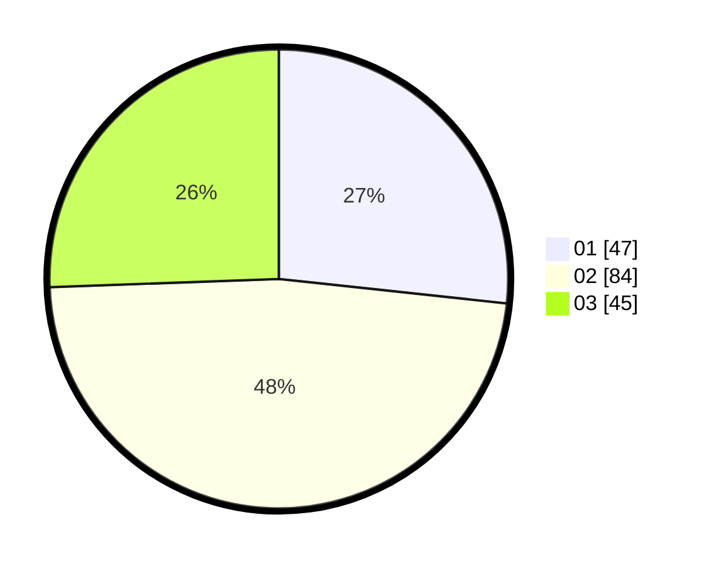

# Hasil

Hasil perolehan suara paslon dapat dilihat pada file paslon-01.txt, paslon-02.txt, dan paslon-03.txt.

Jika tidak ada, artinya data tersebut belum ada pada SIREKAP.

## Perolehan Suara

 * Paslon 01: **47**.
 * Paslon 02: **84**.
 * Paslon 03: **45**.

## Foto C Plano

https://sirekap-obj-formc.kpu.go.id/aa27/pemilu/ppwp/31/71/03/10/02/3171031002032-20240216-142753--455cd7e1-cb4b-4823-9109-9e9cd37b7243.jpg

https://sirekap-obj-formc.kpu.go.id/aa27/pemilu/ppwp/31/71/03/10/02/3171031002032-20240216-142754--a7f8b1ba-5fc0-4e16-adf6-c72f7998b00b.jpg

https://sirekap-obj-formc.kpu.go.id/aa27/pemilu/ppwp/31/71/03/10/02/3171031002032-20240216-142753--fec7f5c6-2886-4b24-a6df-caa79d46aabf.jpg

## DATA PEMILIH TETAP

Jumlah pemilih dalam DPT: **242**.
 * L: **118**.
 * P: **124**.

## DATA PENGGUNA HAK PILIH

Jumlah pengguna hak pilih dalam DPT: **180**.
 * L: **88**.
 * P: **91**.

Jumlah pengguna hak pilih dalam DPTb: **0**.
 * L: **0**.
 * P: **1**.

Jumlah pengguna hak pilih dalam DPK: **0**.
 * L: **0**.
 * P: **0**.

Jumlah pengguna hak pilih: **180**.
 * L: **88**.
 * P: **92**.

## JUMLAH SUARA SAH DAN TIDAK SAH

JUMLAH SELURUH SUARA SAH: **176**.

JUMLAH SUARA TIDAK SAH: **4**.

JUMLAH SELURUH SUARA SAH DAN SUARA TIDAK SAH: **180**.
