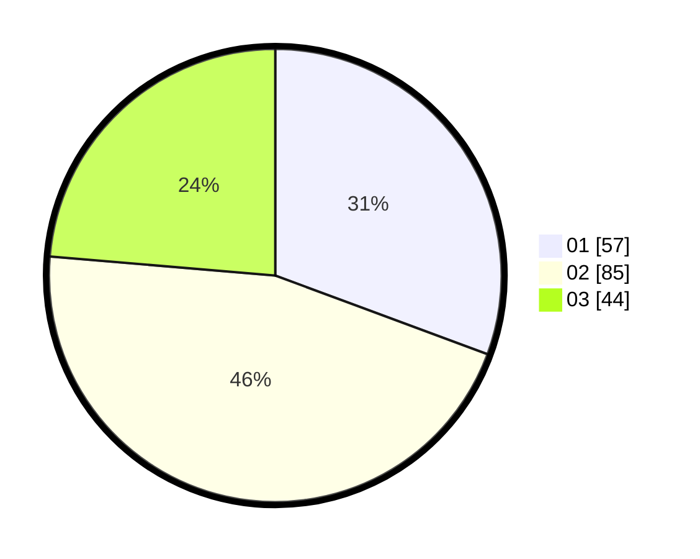

# Hasil

Hasil perolehan suara paslon dapat dilihat pada file paslon-01.txt, paslon-02.txt, dan paslon-03.txt.

Jika tidak ada, artinya data tersebut belum ada pada SIREKAP.

## Perolehan Suara

 * Paslon 01: **57**.
 * Paslon 02: **85**.
 * Paslon 03: **44**.

## Foto C Plano

https://sirekap-obj-formc.kpu.go.id/67c3/pemilu/ppwp/31/71/03/10/02/3171031002033-20240216-093154--2ef022af-f8c8-4903-ba57-f28c607349c5.jpg

https://sirekap-obj-formc.kpu.go.id/67c3/pemilu/ppwp/31/71/03/10/02/3171031002033-20240216-095204--b1450b93-cf71-42f1-b29a-870f4de68785.jpg

https://sirekap-obj-formc.kpu.go.id/67c3/pemilu/ppwp/31/71/03/10/02/3171031002033-20240216-111240--0852c93b-6634-488e-ac78-84a6b4489b8b.jpg

## DATA PEMILIH TETAP

Jumlah pemilih dalam DPT: **236**.
 * L: **118**.
 * P: **118**.

## DATA PENGGUNA HAK PILIH

Jumlah pengguna hak pilih dalam DPT: **180**.
 * L: **90**.
 * P: **90**.

Jumlah pengguna hak pilih dalam DPTb: **6**.
 * L: **6**.
 * P: **0**.

Jumlah pengguna hak pilih dalam DPK: **0**.
 * L: **0**.
 * P: **0**.

Jumlah pengguna hak pilih: **186**.
 * L: **96**.
 * P: **90**.

## JUMLAH SUARA SAH DAN TIDAK SAH

JUMLAH SELURUH SUARA SAH: **186**.

JUMLAH SUARA TIDAK SAH: **0**.

JUMLAH SELURUH SUARA SAH DAN SUARA TIDAK SAH: **186**.
