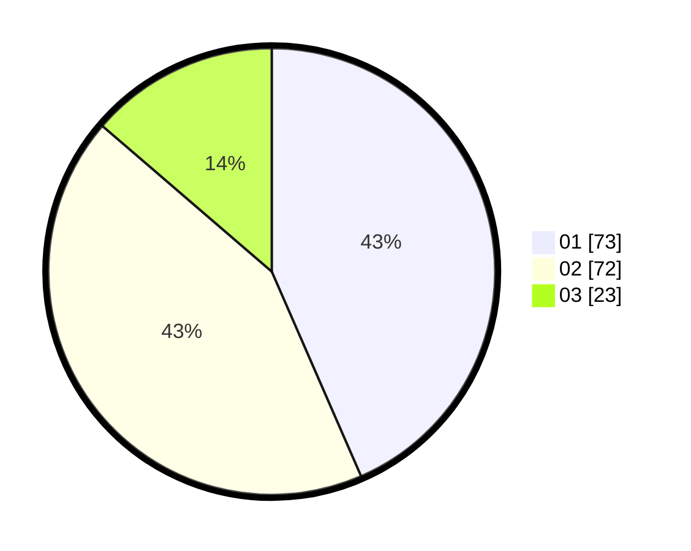

# Hasil

Hasil perolehan suara paslon dapat dilihat pada file paslon-01.txt, paslon-02.txt, dan paslon-03.txt.

Jika tidak ada, artinya data tersebut belum ada pada SIREKAP.

## Perolehan Suara

 * Paslon 01: **73**.
 * Paslon 02: **72**.
 * Paslon 03: **23**.

## Foto C Plano

https://sirekap-obj-formc.kpu.go.id/80b8/pemilu/ppwp/31/71/03/10/02/3171031002035-20240214-224257--c623ec0b-e90a-4980-bb18-9a19f73b51d6.jpg

https://sirekap-obj-formc.kpu.go.id/80b8/pemilu/ppwp/31/71/03/10/02/3171031002035-20240214-224302--d730aef5-d5e9-4a54-84a5-9da1295e8523.jpg

https://sirekap-obj-formc.kpu.go.id/80b8/pemilu/ppwp/31/71/03/10/02/3171031002035-20240214-224308--4df3861c-0ecc-438a-bdf5-00046f1ce4e3.jpg

## DATA PEMILIH TETAP

Jumlah pemilih dalam DPT: **225**.
 * L: **118**.
 * P: **107**.

## DATA PENGGUNA HAK PILIH

Jumlah pengguna hak pilih dalam DPT: **167**.
 * L: **84**.
 * P: **83**.

Jumlah pengguna hak pilih dalam DPTb: **0**.
 * L: **0**.
 * P: **0**.

Jumlah pengguna hak pilih dalam DPK: **3**.
 * L: **2**.
 * P: **1**.

Jumlah pengguna hak pilih: **170**.
 * L: **86**.
 * P: **84**.

## JUMLAH SUARA SAH DAN TIDAK SAH

JUMLAH SELURUH SUARA SAH: **168**.

JUMLAH SUARA TIDAK SAH: **2**.

JUMLAH SELURUH SUARA SAH DAN SUARA TIDAK SAH: **170**.
