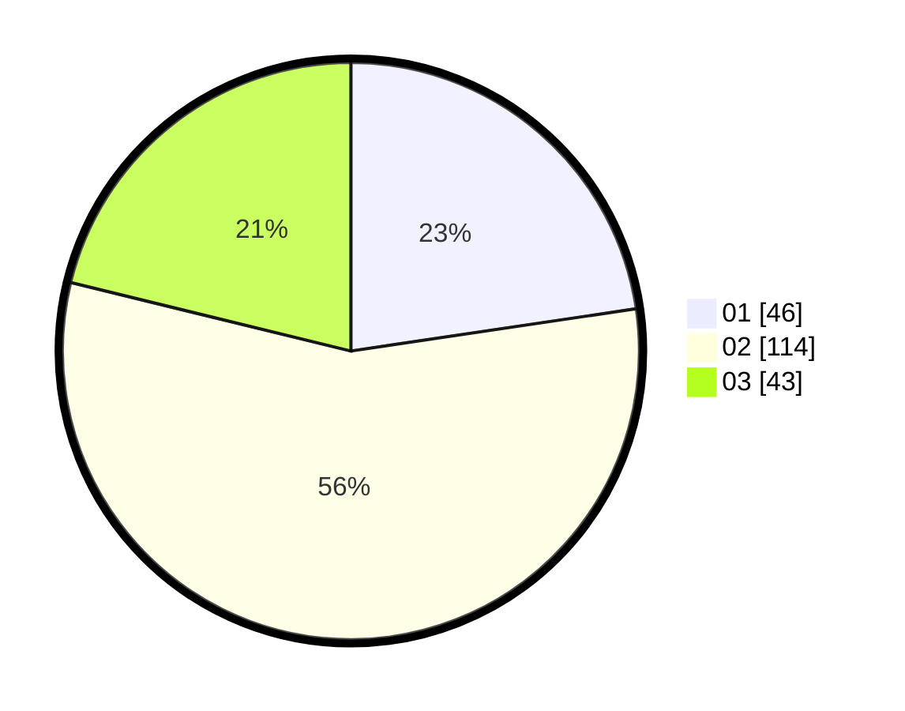

# Hasil

Hasil perolehan suara paslon dapat dilihat pada file paslon-01.txt, paslon-02.txt, dan paslon-03.txt.

Jika tidak ada, artinya data tersebut belum ada pada SIREKAP.

## Perolehan Suara

 * Paslon 01: **46**.
 * Paslon 02: **114**.
 * Paslon 03: **43**.

## Foto C Plano

https://sirekap-obj-formc.kpu.go.id/c5d3/pemilu/ppwp/31/71/03/10/02/3171031002037-20240216-140007--ecc29470-45db-4970-a0fd-22502efab9b4.jpg

https://sirekap-obj-formc.kpu.go.id/c5d3/pemilu/ppwp/31/71/03/10/02/3171031002037-20240216-140008--791ee083-3e41-414a-822e-563b95f61de2.jpg

https://sirekap-obj-formc.kpu.go.id/c5d3/pemilu/ppwp/31/71/03/10/02/3171031002037-20240216-140008--b1074a11-e203-4801-b851-bdccfacd2e28.jpg

## DATA PEMILIH TETAP

Jumlah pemilih dalam DPT: **267**.
 * L: **145**.
 * P: **122**.

## DATA PENGGUNA HAK PILIH

Jumlah pengguna hak pilih dalam DPT: **203**.
 * L: **105**.
 * P: **98**.

Jumlah pengguna hak pilih dalam DPTb: **0**.
 * L: **0**.
 * P: **0**.

Jumlah pengguna hak pilih dalam DPK: **0**.
 * L: **0**.
 * P: **0**.

Jumlah pengguna hak pilih: **203**.
 * L: **105**.
 * P: **98**.

## JUMLAH SUARA SAH DAN TIDAK SAH

JUMLAH SELURUH SUARA SAH: **203**.

JUMLAH SUARA TIDAK SAH: **0**.

JUMLAH SELURUH SUARA SAH DAN SUARA TIDAK SAH: **203**.
