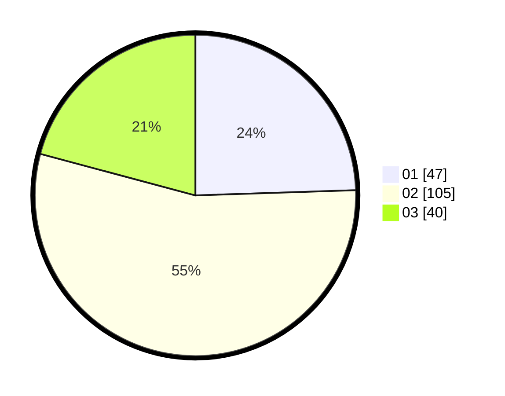

# Hasil

Hasil perolehan suara paslon dapat dilihat pada file paslon-01.txt, paslon-02.txt, dan paslon-03.txt.

Jika tidak ada, artinya data tersebut belum ada pada SIREKAP.

## Perolehan Suara

 * Paslon 01: **47**.
 * Paslon 02: **105**.
 * Paslon 03: **40**.

## Foto C Plano

https://sirekap-obj-formc.kpu.go.id/9676/pemilu/ppwp/31/71/03/10/02/3171031002038-20240216-125725--331ab7ad-e0fd-485e-aeba-12b28c94a91e.jpg

https://sirekap-obj-formc.kpu.go.id/9676/pemilu/ppwp/31/71/03/10/02/3171031002038-20240214-215839--bf1c6c0e-2347-48be-928e-723ed26537d9.jpg

https://sirekap-obj-formc.kpu.go.id/9676/pemilu/ppwp/31/71/03/10/02/3171031002038-20240216-125730--cd485eee-4836-41cd-a097-d1cc86609f1a.jpg

## DATA PEMILIH TETAP

Jumlah pemilih dalam DPT: **270**.
 * L: **138**.
 * P: **132**.

## DATA PENGGUNA HAK PILIH

Jumlah pengguna hak pilih dalam DPT: **190**.
 * L: **94**.
 * P: **96**.

Jumlah pengguna hak pilih dalam DPTb: **0**.
 * L: **0**.
 * P: **0**.

Jumlah pengguna hak pilih dalam DPK: **4**.
 * L: **3**.
 * P: **1**.

Jumlah pengguna hak pilih: **194**.
 * L: **97**.
 * P: **97**.

## JUMLAH SUARA SAH DAN TIDAK SAH

JUMLAH SELURUH SUARA SAH: **192**.

JUMLAH SUARA TIDAK SAH: **2**.

JUMLAH SELURUH SUARA SAH DAN SUARA TIDAK SAH: **194**.
