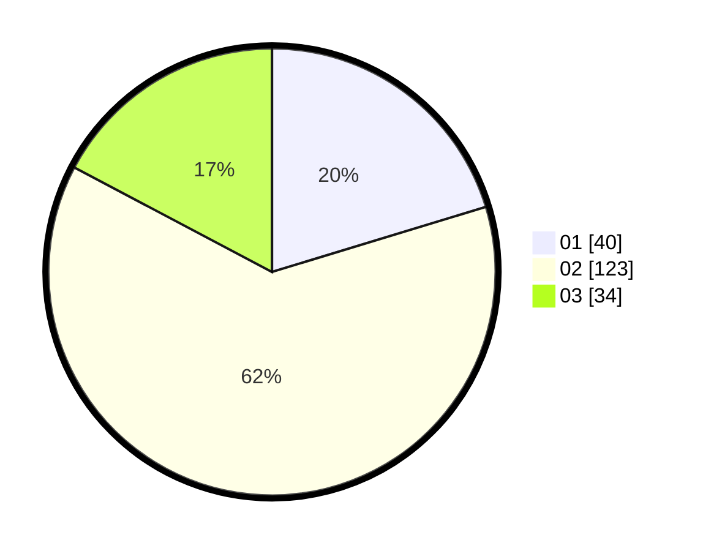

# Hasil

Hasil perolehan suara paslon dapat dilihat pada file paslon-01.txt, paslon-02.txt, dan paslon-03.txt.

Jika tidak ada, artinya data tersebut belum ada pada SIREKAP.

## Perolehan Suara

 * Paslon 01: **40**.
 * Paslon 02: **123**.
 * Paslon 03: **34**.

## Foto C Plano

https://sirekap-obj-formc.kpu.go.id/617b/pemilu/ppwp/31/71/03/10/02/3171031002043-20240214-155012--d923b4af-4e3e-4664-8425-14202c845e6f.jpg

https://sirekap-obj-formc.kpu.go.id/617b/pemilu/ppwp/31/71/03/10/02/3171031002043-20240214-160122--6503d792-5562-4494-9a6a-337efa68e31c.jpg

https://sirekap-obj-formc.kpu.go.id/617b/pemilu/ppwp/31/71/03/10/02/3171031002043-20240214-184819--c240a5a3-2b64-44c4-85a5-fb513c82f0de.jpg

## DATA PEMILIH TETAP

Jumlah pemilih dalam DPT: **270**.
 * L: **136**.
 * P: **134**.

## DATA PENGGUNA HAK PILIH

Jumlah pengguna hak pilih dalam DPT: **202**.
 * L: **100**.
 * P: **102**.

Jumlah pengguna hak pilih dalam DPTb: **5**.
 * L: **2**.
 * P: **3**.

Jumlah pengguna hak pilih dalam DPK: **0**.
 * L: **0**.
 * P: **0**.

Jumlah pengguna hak pilih: **207**.
 * L: **102**.
 * P: **105**.

## JUMLAH SUARA SAH DAN TIDAK SAH

JUMLAH SELURUH SUARA SAH: **197**.

JUMLAH SUARA TIDAK SAH: **10**.

JUMLAH SELURUH SUARA SAH DAN SUARA TIDAK SAH: **207**.
