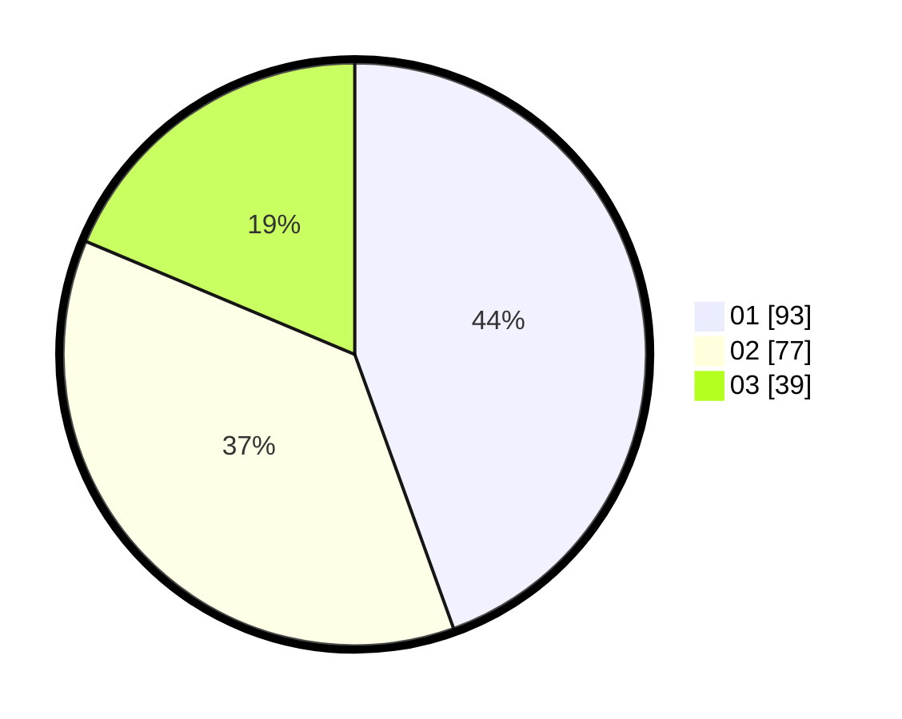

# Hasil

Hasil perolehan suara paslon dapat dilihat pada file paslon-01.txt, paslon-02.txt, dan paslon-03.txt.

Jika tidak ada, artinya data tersebut belum ada pada SIREKAP.

## Perolehan Suara

 * Paslon 01: **93**.
 * Paslon 02: **77**.
 * Paslon 03: **39**.

## Foto C Plano

https://sirekap-obj-formc.kpu.go.id/159a/pemilu/ppwp/31/71/03/10/02/3171031002045-20240214-190108--931d6eaf-ab46-4baa-8505-1d957af92fe2.jpg

https://sirekap-obj-formc.kpu.go.id/159a/pemilu/ppwp/31/71/03/10/02/3171031002045-20240214-191501--1e5e583f-940d-4bb9-89bf-9627a29fb287.jpg

https://sirekap-obj-formc.kpu.go.id/159a/pemilu/ppwp/31/71/03/10/02/3171031002045-20240214-190808--4f860599-dd0b-4daa-96cb-07b7de2b0577.jpg

## DATA PEMILIH TETAP

Jumlah pemilih dalam DPT: **247**.
 * L: **125**.
 * P: **122**.

## DATA PENGGUNA HAK PILIH

Jumlah pengguna hak pilih dalam DPT: **210**.
 * L: **100**.
 * P: **110**.

Jumlah pengguna hak pilih dalam DPTb: **0**.
 * L: **0**.
 * P: **0**.

Jumlah pengguna hak pilih dalam DPK: **4**.
 * L: **3**.
 * P: **1**.

Jumlah pengguna hak pilih: **214**.
 * L: **103**.
 * P: **111**.

## JUMLAH SUARA SAH DAN TIDAK SAH

JUMLAH SELURUH SUARA SAH: **209**.

JUMLAH SUARA TIDAK SAH: **5**.

JUMLAH SELURUH SUARA SAH DAN SUARA TIDAK SAH: **214**.
