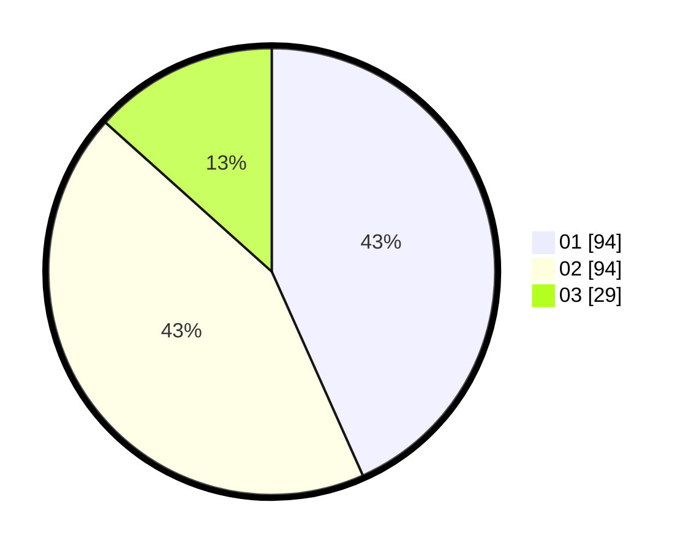

# Hasil

Hasil perolehan suara paslon dapat dilihat pada file paslon-01.txt, paslon-02.txt, dan paslon-03.txt.

Jika tidak ada, artinya data tersebut belum ada pada SIREKAP.

## Perolehan Suara

 * Paslon 01: **94**.
 * Paslon 02: **94**.
 * Paslon 03: **29**.

## Foto C Plano

https://sirekap-obj-formc.kpu.go.id/beae/pemilu/ppwp/31/71/03/10/02/3171031002049-20240214-214746--7461dfd4-b708-4689-ab4d-3b868c4b3c44.jpg

https://sirekap-obj-formc.kpu.go.id/beae/pemilu/ppwp/31/71/03/10/02/3171031002049-20240214-214810--25614dd7-54ca-4007-88c7-4d3055d003d9.jpg

https://sirekap-obj-formc.kpu.go.id/beae/pemilu/ppwp/31/71/03/10/02/3171031002049-20240214-214759--b88100d8-1f79-4bd4-aae1-2c02191efb8a.jpg

## DATA PEMILIH TETAP

Jumlah pemilih dalam DPT: **259**.
 * L: **127**.
 * P: **132**.

## DATA PENGGUNA HAK PILIH

Jumlah pengguna hak pilih dalam DPT: **205**.
 * L: **92**.
 * P: **113**.

Jumlah pengguna hak pilih dalam DPTb: **16**.
 * L: **3**.
 * P: **13**.

Jumlah pengguna hak pilih dalam DPK: **2**.
 * L: **1**.
 * P: **1**.

Jumlah pengguna hak pilih: **223**.
 * L: **96**.
 * P: **127**.

## JUMLAH SUARA SAH DAN TIDAK SAH

JUMLAH SELURUH SUARA SAH: **217**.

JUMLAH SUARA TIDAK SAH: **6**.

JUMLAH SELURUH SUARA SAH DAN SUARA TIDAK SAH: **223**.
