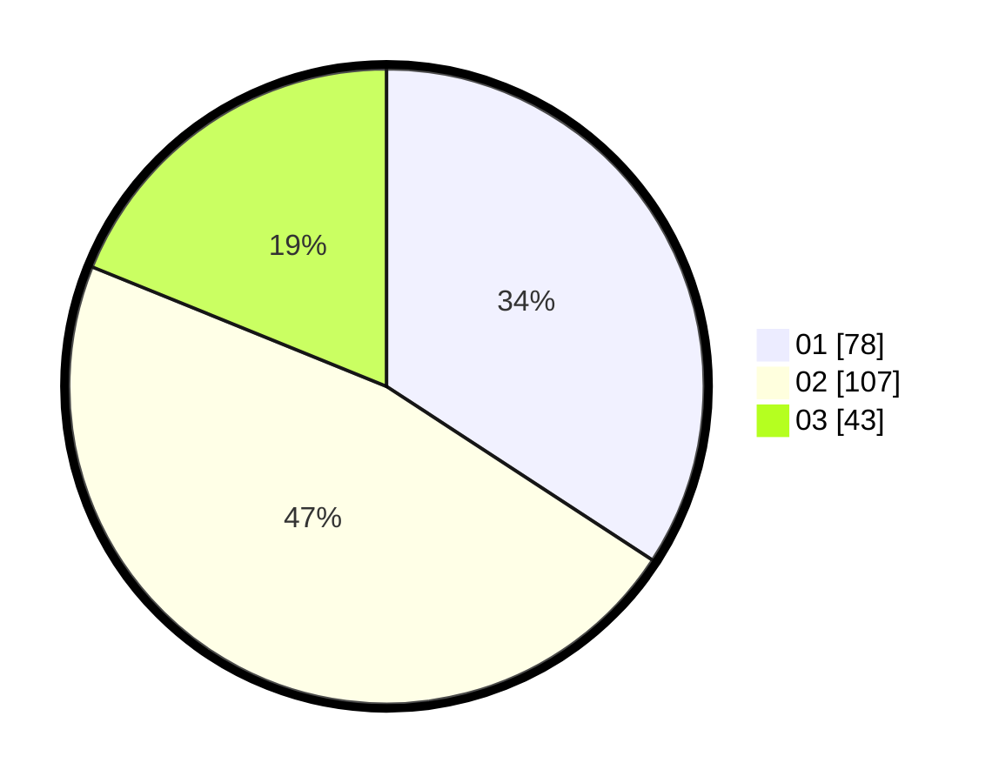

# Hasil

Hasil perolehan suara paslon dapat dilihat pada file paslon-01.txt, paslon-02.txt, dan paslon-03.txt.

Jika tidak ada, artinya data tersebut belum ada pada SIREKAP.

## Perolehan Suara

 * Paslon 01: **78**.
 * Paslon 02: **107**.
 * Paslon 03: **43**.

## Foto C Plano

https://sirekap-obj-formc.kpu.go.id/a04b/pemilu/ppwp/31/71/03/10/02/3171031002050-20240216-142142--ae1a6d31-876d-4289-88a4-8f744834620e.jpg

https://sirekap-obj-formc.kpu.go.id/a04b/pemilu/ppwp/31/71/03/10/02/3171031002050-20240216-144054--fbf82326-a7e4-4f01-9591-c31de69bf53e.jpg

https://sirekap-obj-formc.kpu.go.id/a04b/pemilu/ppwp/31/71/03/10/02/3171031002050-20240216-144505--73657f20-abe5-4d18-b6e5-5150976aa976.jpg

## DATA PEMILIH TETAP

Jumlah pemilih dalam DPT: **234**.
 * L: **112**.
 * P: **122**.

## DATA PENGGUNA HAK PILIH

Jumlah pengguna hak pilih dalam DPT: **234**.
 * L: **112**.
 * P: **122**.

Jumlah pengguna hak pilih dalam DPTb: **0**.
 * L: **0**.
 * P: **0**.

Jumlah pengguna hak pilih dalam DPK: **0**.
 * L: **0**.
 * P: **0**.

Jumlah pengguna hak pilih: **234**.
 * L: **112**.
 * P: **122**.

## JUMLAH SUARA SAH DAN TIDAK SAH

JUMLAH SELURUH SUARA SAH: **228**.

JUMLAH SUARA TIDAK SAH: **6**.

JUMLAH SELURUH SUARA SAH DAN SUARA TIDAK SAH: **234**.
