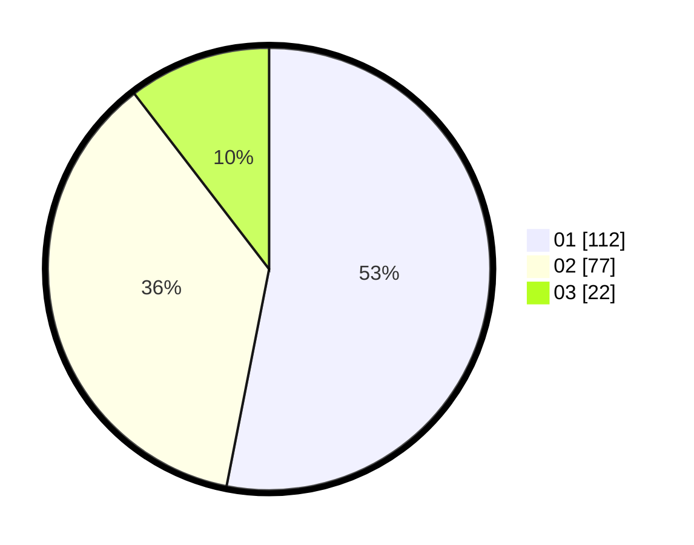

# Hasil

Hasil perolehan suara paslon dapat dilihat pada file paslon-01.txt, paslon-02.txt, dan paslon-03.txt.

Jika tidak ada, artinya data tersebut belum ada pada SIREKAP.

## Perolehan Suara

 * Paslon 01: **112**.
 * Paslon 02: **77**.
 * Paslon 03: **22**.

## Foto C Plano

https://sirekap-obj-formc.kpu.go.id/aace/pemilu/ppwp/31/71/03/10/02/3171031002051-20240216-021258--2aa4ed31-3c18-4636-a2ea-e3bcfe10b658.jpg

https://sirekap-obj-formc.kpu.go.id/aace/pemilu/ppwp/31/71/03/10/02/3171031002051-20240216-021300--b5c6f074-60f3-4a38-af3e-559cf1c4f270.jpg

https://sirekap-obj-formc.kpu.go.id/aace/pemilu/ppwp/31/71/03/10/02/3171031002051-20240216-021259--6524b514-1b04-4995-a481-3463108c505a.jpg

## DATA PEMILIH TETAP

Jumlah pemilih dalam DPT: **277**.
 * L: **139**.
 * P: **138**.

## DATA PENGGUNA HAK PILIH

Jumlah pengguna hak pilih dalam DPT: **213**.
 * L: **101**.
 * P: **112**.

Jumlah pengguna hak pilih dalam DPTb: **2**.
 * L: **0**.
 * P: **2**.

Jumlah pengguna hak pilih dalam DPK: **3**.
 * L: **1**.
 * P: **2**.

Jumlah pengguna hak pilih: **218**.
 * L: **102**.
 * P: **116**.

## JUMLAH SUARA SAH DAN TIDAK SAH

JUMLAH SELURUH SUARA SAH: **211**.

JUMLAH SUARA TIDAK SAH: **7**.

JUMLAH SELURUH SUARA SAH DAN SUARA TIDAK SAH: **218**.
