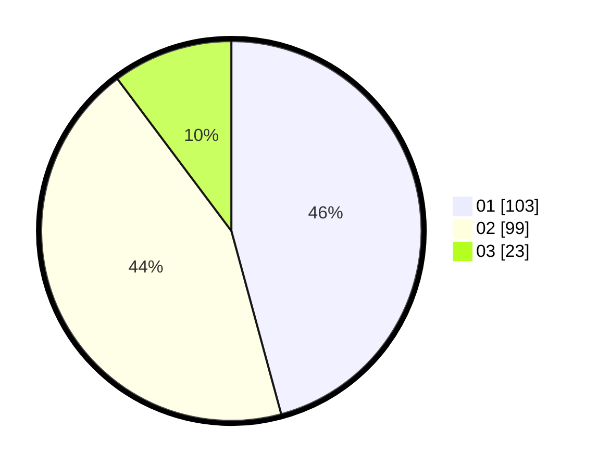

# Hasil

Hasil perolehan suara paslon dapat dilihat pada file paslon-01.txt, paslon-02.txt, dan paslon-03.txt.

Jika tidak ada, artinya data tersebut belum ada pada SIREKAP.

## Perolehan Suara

 * Paslon 01: **103**.
 * Paslon 02: **99**.
 * Paslon 03: **23**.

## Foto C Plano

https://sirekap-obj-formc.kpu.go.id/f467/pemilu/ppwp/31/71/03/10/02/3171031002054-20240214-213726--1ed78ae7-6399-49d0-bd57-a75737fda83d.jpg

https://sirekap-obj-formc.kpu.go.id/f467/pemilu/ppwp/31/71/03/10/02/3171031002054-20240214-213832--e60df0a5-26b9-427e-96e5-779da09ef6dd.jpg

https://sirekap-obj-formc.kpu.go.id/f467/pemilu/ppwp/31/71/03/10/02/3171031002054-20240214-213910--0329175b-bec2-4a49-b759-b2212e421eba.jpg

## DATA PEMILIH TETAP

Jumlah pemilih dalam DPT: **284**.
 * L: **144**.
 * P: **140**.

## DATA PENGGUNA HAK PILIH

Jumlah pengguna hak pilih dalam DPT: **231**.
 * L: **113**.
 * P: **118**.

Jumlah pengguna hak pilih dalam DPTb: **0**.
 * L: **0**.
 * P: **0**.

Jumlah pengguna hak pilih dalam DPK: **1**.
 * L: **1**.
 * P: **0**.

Jumlah pengguna hak pilih: **232**.
 * L: **114**.
 * P: **118**.

## JUMLAH SUARA SAH DAN TIDAK SAH

JUMLAH SELURUH SUARA SAH: **225**.

JUMLAH SUARA TIDAK SAH: **7**.

JUMLAH SELURUH SUARA SAH DAN SUARA TIDAK SAH: **232**.
