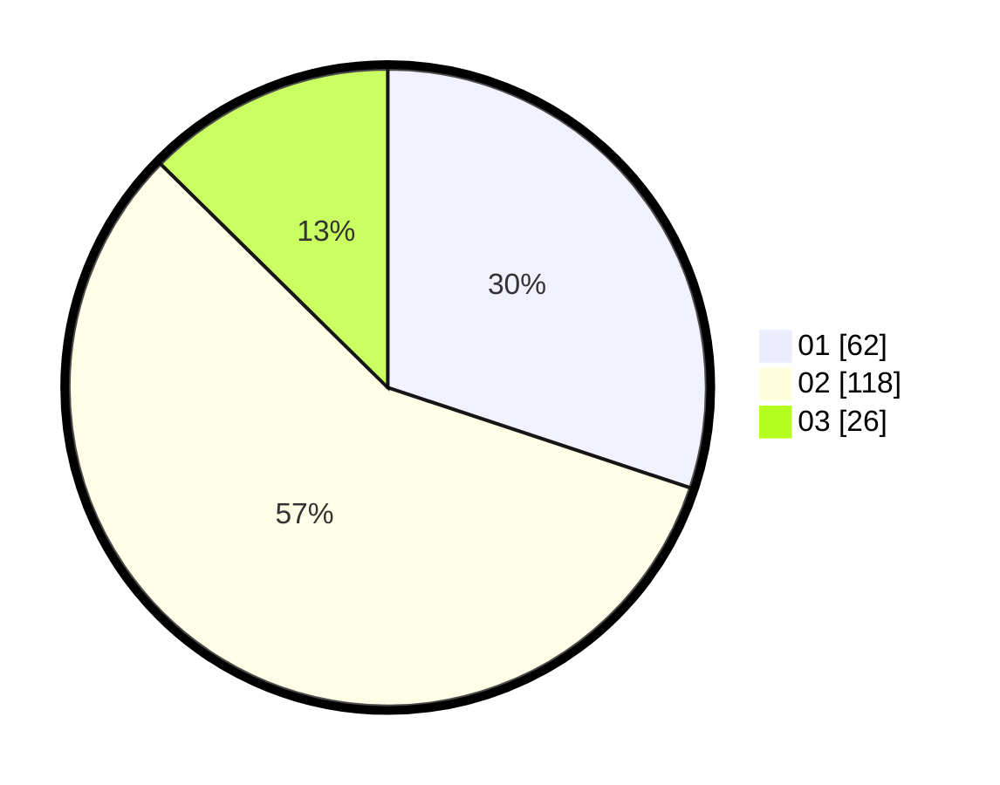

# Hasil

Hasil perolehan suara paslon dapat dilihat pada file paslon-01.txt, paslon-02.txt, dan paslon-03.txt.

Jika tidak ada, artinya data tersebut belum ada pada SIREKAP.

## Perolehan Suara

 * Paslon 01: **62**.
 * Paslon 02: **118**.
 * Paslon 03: **26**.

## Foto C Plano

https://sirekap-obj-formc.kpu.go.id/bb7d/pemilu/ppwp/31/71/03/10/02/3171031002056-20240216-191018--b4e57747-916d-432b-a2bf-8ccaca7108f1.jpg

https://sirekap-obj-formc.kpu.go.id/bb7d/pemilu/ppwp/31/71/03/10/02/3171031002056-20240216-191717--8796aa30-94c6-4216-864e-25e8eef2b6a0.jpg

https://sirekap-obj-formc.kpu.go.id/bb7d/pemilu/ppwp/31/71/03/10/02/3171031002056-20240216-191349--7a1ce9a7-0e67-47a2-b90e-aec4a25fa510.jpg

## DATA PEMILIH TETAP

Jumlah pemilih dalam DPT: **258**.
 * L: **120**.
 * P: **138**.

## DATA PENGGUNA HAK PILIH

Jumlah pengguna hak pilih dalam DPT: **209**.
 * L: **96**.
 * P: **113**.

Jumlah pengguna hak pilih dalam DPTb: **0**.
 * L: **0**.
 * P: **0**.

Jumlah pengguna hak pilih dalam DPK: **2**.
 * L: **1**.
 * P: **1**.

Jumlah pengguna hak pilih: **211**.
 * L: **97**.
 * P: **114**.

## JUMLAH SUARA SAH DAN TIDAK SAH

JUMLAH SELURUH SUARA SAH: **206**.

JUMLAH SUARA TIDAK SAH: **5**.

JUMLAH SELURUH SUARA SAH DAN SUARA TIDAK SAH: **211**.
