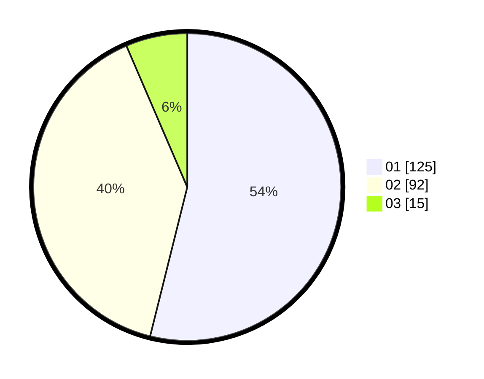

# Hasil

Hasil perolehan suara paslon dapat dilihat pada file paslon-01.txt, paslon-02.txt, dan paslon-03.txt.

Jika tidak ada, artinya data tersebut belum ada pada SIREKAP.

## Perolehan Suara

 * Paslon 01: **125**.
 * Paslon 02: **92**.
 * Paslon 03: **15**.

## Foto C Plano

https://sirekap-obj-formc.kpu.go.id/8314/pemilu/ppwp/31/71/03/10/02/3171031002057-20240214-215218--6b22ad89-9a98-4f8b-8db0-b712e76c26b0.jpg

https://sirekap-obj-formc.kpu.go.id/8314/pemilu/ppwp/31/71/03/10/02/3171031002057-20240215-003745--0cd920b3-f15c-43ba-bdec-b8a7fee37d25.jpg

https://sirekap-obj-formc.kpu.go.id/8314/pemilu/ppwp/31/71/03/10/02/3171031002057-20240216-104711--b5913e47-f962-4278-81df-c3bc63576c86.jpg
