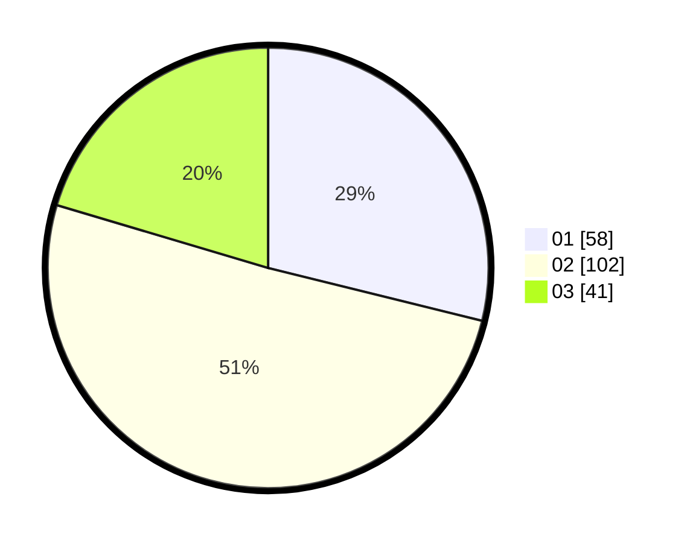

# Hasil

Hasil perolehan suara paslon dapat dilihat pada file paslon-01.txt, paslon-02.txt, dan paslon-03.txt.

Jika tidak ada, artinya data tersebut belum ada pada SIREKAP.

## Perolehan Suara

 * Paslon 01: **58**.
 * Paslon 02: **102**.
 * Paslon 03: **41**.

## Foto C Plano

https://sirekap-obj-formc.kpu.go.id/ea0f/pemilu/ppwp/31/71/03/10/02/3171031002064-20240216-142313--c83b84f7-791b-4d4c-8036-f0ed70f2bfa9.jpg

https://sirekap-obj-formc.kpu.go.id/ea0f/pemilu/ppwp/31/71/03/10/02/3171031002064-20240216-142313--9e0b27dc-fb7d-4b16-a946-2d499e895d98.jpg

https://sirekap-obj-formc.kpu.go.id/ea0f/pemilu/ppwp/31/71/03/10/02/3171031002064-20240214-235933--9820d9e4-3ca4-4d30-8502-5290ed965c66.jpg

## DATA PEMILIH TETAP

Jumlah pemilih dalam DPT: **281**.
 * L: **133**.
 * P: **148**.

## DATA PENGGUNA HAK PILIH

Jumlah pengguna hak pilih dalam DPT: **201**.
 * L: **94**.
 * P: **107**.

Jumlah pengguna hak pilih dalam DPTb: **0**.
 * L: **0**.
 * P: **0**.

Jumlah pengguna hak pilih dalam DPK: **5**.
 * L: **1**.
 * P: **4**.

Jumlah pengguna hak pilih: **206**.
 * L: **95**.
 * P: **111**.

## JUMLAH SUARA SAH DAN TIDAK SAH

JUMLAH SELURUH SUARA SAH: **201**.

JUMLAH SUARA TIDAK SAH: **5**.

JUMLAH SELURUH SUARA SAH DAN SUARA TIDAK SAH: **206**.
