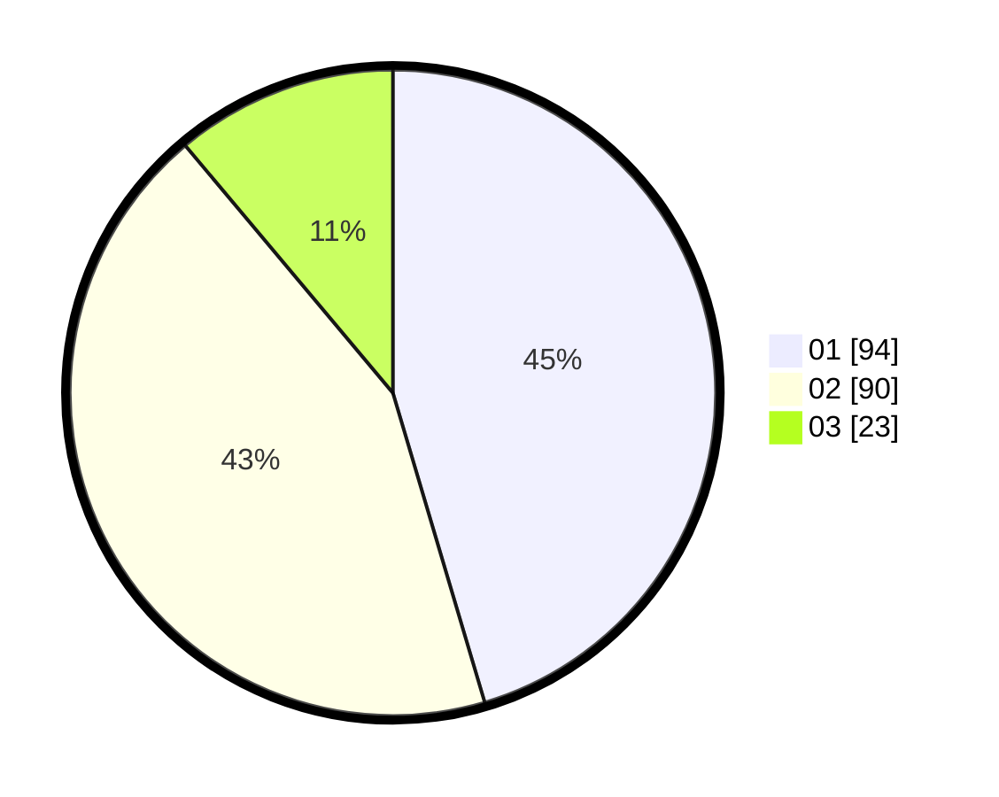

# Hasil

Hasil perolehan suara paslon dapat dilihat pada file paslon-01.txt, paslon-02.txt, dan paslon-03.txt.

Jika tidak ada, artinya data tersebut belum ada pada SIREKAP.

## Perolehan Suara

 * Paslon 01: **94**.
 * Paslon 02: **90**.
 * Paslon 03: **23**.

## Foto C Plano

https://sirekap-obj-formc.kpu.go.id/8bbd/pemilu/ppwp/31/71/03/10/02/3171031002065-20240214-213158--dfbab9d9-5c33-430e-a1dd-27010fbfbccd.jpg

https://sirekap-obj-formc.kpu.go.id/8bbd/pemilu/ppwp/31/71/03/10/02/3171031002065-20240214-213202--fe765435-0512-4f3d-bae6-82a90d3cad8b.jpg

https://sirekap-obj-formc.kpu.go.id/8bbd/pemilu/ppwp/31/71/03/10/02/3171031002065-20240216-110623--5917ab5f-3883-46d5-bde7-4844e47028cf.jpg

## DATA PEMILIH TETAP

Jumlah pemilih dalam DPT: **273**.
 * L: **129**.
 * P: **144**.

## DATA PENGGUNA HAK PILIH

Jumlah pengguna hak pilih dalam DPT: **204**.
 * L: **93**.
 * P: **111**.

Jumlah pengguna hak pilih dalam DPTb: **2**.
 * L: **1**.
 * P: **1**.

Jumlah pengguna hak pilih dalam DPK: **3**.
 * L: **1**.
 * P: **2**.

Jumlah pengguna hak pilih: **209**.
 * L: **95**.
 * P: **114**.

## JUMLAH SUARA SAH DAN TIDAK SAH

JUMLAH SELURUH SUARA SAH: **207**.

JUMLAH SUARA TIDAK SAH: **2**.

JUMLAH SELURUH SUARA SAH DAN SUARA TIDAK SAH: **209**.
