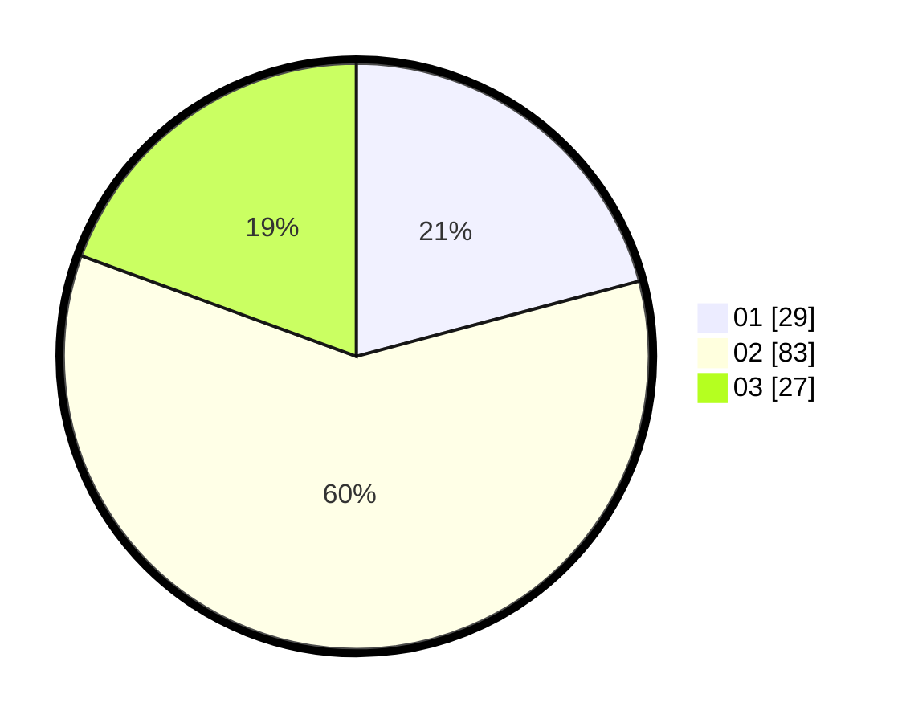

# Hasil

Hasil perolehan suara paslon dapat dilihat pada file paslon-01.txt, paslon-02.txt, dan paslon-03.txt.

Jika tidak ada, artinya data tersebut belum ada pada SIREKAP.

## Perolehan Suara

 * Paslon 01: **29**.
 * Paslon 02: **83**.
 * Paslon 03: **27**.

## Foto C Plano

https://sirekap-obj-formc.kpu.go.id/37d1/pemilu/ppwp/31/71/03/10/02/3171031002071-20240215-004649--342235f5-6352-4c8f-b403-c857ce3d7312.jpg

https://sirekap-obj-formc.kpu.go.id/37d1/pemilu/ppwp/31/71/03/10/02/3171031002071-20240215-010603--fbf0c3d7-0bb9-4280-8a24-79a08ceb7482.jpg

https://sirekap-obj-formc.kpu.go.id/37d1/pemilu/ppwp/31/71/03/10/02/3171031002071-20240215-022338--58b864c2-858a-40b8-8db9-0cd4f6e081d3.jpg
