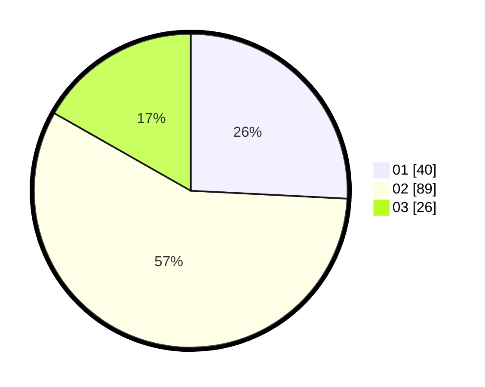

# Hasil

Hasil perolehan suara paslon dapat dilihat pada file paslon-01.txt, paslon-02.txt, dan paslon-03.txt.

Jika tidak ada, artinya data tersebut belum ada pada SIREKAP.

## Perolehan Suara

 * Paslon 01: **40**.
 * Paslon 02: **89**.
 * Paslon 03: **26**.

## Foto C Plano

https://sirekap-obj-formc.kpu.go.id/2d28/pemilu/ppwp/31/71/03/10/02/3171031002072-20240216-194116--d74224b7-cdca-46f3-a70a-b423e42ff9f1.jpg

https://sirekap-obj-formc.kpu.go.id/2d28/pemilu/ppwp/31/71/03/10/02/3171031002072-20240216-194117--93d12f61-de07-4af8-b05b-055792863b69.jpg

https://sirekap-obj-formc.kpu.go.id/2d28/pemilu/ppwp/31/71/03/10/02/3171031002072-20240216-194117--1d2b1a35-5b4e-4adf-ab98-490d7e12bc3e.jpg

## DATA PEMILIH TETAP

Jumlah pemilih dalam DPT: **263**.
 * L: **125**.
 * P: **138**.

## DATA PENGGUNA HAK PILIH

Jumlah pengguna hak pilih dalam DPT: **148**.
 * L: **69**.
 * P: **79**.

Jumlah pengguna hak pilih dalam DPTb: **7**.
 * L: **2**.
 * P: **5**.

Jumlah pengguna hak pilih dalam DPK: **3**.
 * L: **2**.
 * P: **1**.

Jumlah pengguna hak pilih: **158**.
 * L: **73**.
 * P: **85**.

## JUMLAH SUARA SAH DAN TIDAK SAH

JUMLAH SELURUH SUARA SAH: **155**.

JUMLAH SUARA TIDAK SAH: **3**.

JUMLAH SELURUH SUARA SAH DAN SUARA TIDAK SAH: **158**.
