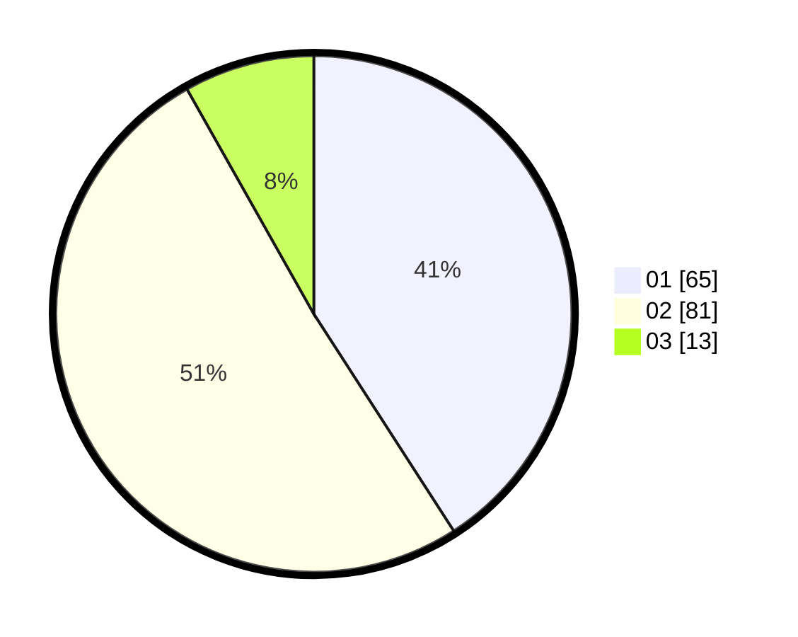

# Hasil

Hasil perolehan suara paslon dapat dilihat pada file paslon-01.txt, paslon-02.txt, dan paslon-03.txt.

Jika tidak ada, artinya data tersebut belum ada pada SIREKAP.

## Perolehan Suara

 * Paslon 01: **65**.
 * Paslon 02: **81**.
 * Paslon 03: **13**.

## Foto C Plano

https://sirekap-obj-formc.kpu.go.id/642a/pemilu/ppwp/31/71/03/10/02/3171031002073-20240216-162836--9232c06c-53f6-4cf9-b40c-382e56068c5c.jpg

https://sirekap-obj-formc.kpu.go.id/642a/pemilu/ppwp/31/71/03/10/02/3171031002073-20240216-162626--6cd3c132-a2d2-4664-94e9-2c2d41f2c240.jpg

https://sirekap-obj-formc.kpu.go.id/642a/pemilu/ppwp/31/71/03/10/02/3171031002073-20240216-162109--9e2649fc-be77-443b-9f15-a6b69a46bc76.jpg

## DATA PEMILIH TETAP

Jumlah pemilih dalam DPT: **262**.
 * L: **130**.
 * P: **132**.

## DATA PENGGUNA HAK PILIH

Jumlah pengguna hak pilih dalam DPT: **154**.
 * L: **77**.
 * P: **77**.

Jumlah pengguna hak pilih dalam DPTb: **7**.
 * L: **0**.
 * P: **7**.

Jumlah pengguna hak pilih dalam DPK: **1**.
 * L: **0**.
 * P: **1**.

Jumlah pengguna hak pilih: **162**.
 * L: **77**.
 * P: **85**.

## JUMLAH SUARA SAH DAN TIDAK SAH

JUMLAH SELURUH SUARA SAH: **159**.

JUMLAH SUARA TIDAK SAH: **3**.

JUMLAH SELURUH SUARA SAH DAN SUARA TIDAK SAH: **162**.
