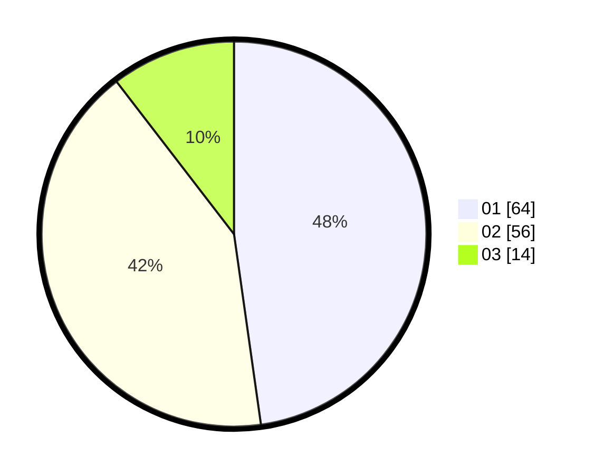

# Hasil

Hasil perolehan suara paslon dapat dilihat pada file paslon-01.txt, paslon-02.txt, dan paslon-03.txt.

Jika tidak ada, artinya data tersebut belum ada pada SIREKAP.

## Perolehan Suara

 * Paslon 01: **64**.
 * Paslon 02: **56**.
 * Paslon 03: **14**.

## Foto C Plano

https://sirekap-obj-formc.kpu.go.id/2219/pemilu/ppwp/31/71/03/10/02/3171031002074-20240216-221022--90c518b2-361b-4095-9db7-ff67664b6510.jpg

https://sirekap-obj-formc.kpu.go.id/2219/pemilu/ppwp/31/71/03/10/02/3171031002074-20240216-222429--ee5d2c66-cfd2-4e0b-9151-1edb1b8b268b.jpg

https://sirekap-obj-formc.kpu.go.id/2219/pemilu/ppwp/31/71/03/10/02/3171031002074-20240216-221604--144240dd-daad-472a-864e-46b600f57a2a.jpg

## DATA PEMILIH TETAP

Jumlah pemilih dalam DPT: **283**.
 * L: **102**.
 * P: **181**.

## DATA PENGGUNA HAK PILIH

Jumlah pengguna hak pilih dalam DPT: **131**.
 * L: **60**.
 * P: **71**.

Jumlah pengguna hak pilih dalam DPTb: **131**.
 * L: **1**.
 * P: **71**.

Jumlah pengguna hak pilih dalam DPK: **0**.
 * L: **0**.
 * P: **0**.

Jumlah pengguna hak pilih: **131**.
 * L: **61**.
 * P: **71**.

## JUMLAH SUARA SAH DAN TIDAK SAH

JUMLAH SELURUH SUARA SAH: **134**.

JUMLAH SUARA TIDAK SAH: **3**.

JUMLAH SELURUH SUARA SAH DAN SUARA TIDAK SAH: **137**.
