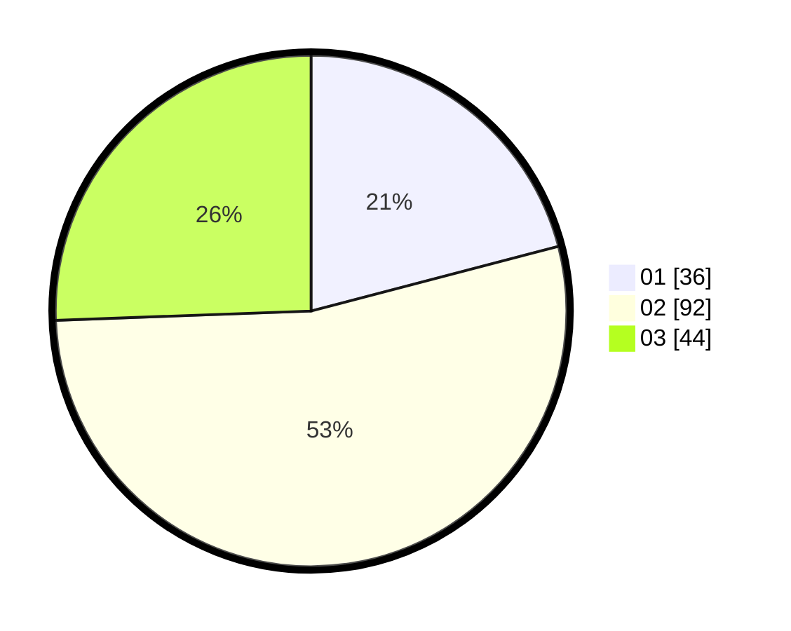

# Hasil

Hasil perolehan suara paslon dapat dilihat pada file paslon-01.txt, paslon-02.txt, dan paslon-03.txt.

Jika tidak ada, artinya data tersebut belum ada pada SIREKAP.

## Perolehan Suara

 * Paslon 01: **36**.
 * Paslon 02: **92**.
 * Paslon 03: **44**.

## Foto C Plano

https://sirekap-obj-formc.kpu.go.id/d6d7/pemilu/ppwp/31/71/03/10/02/3171031002077-20240214-201926--fe3c85ae-c1bf-4450-91e8-8bc7ffb7a58c.jpg

https://sirekap-obj-formc.kpu.go.id/d6d7/pemilu/ppwp/31/71/03/10/02/3171031002077-20240214-212921--59663fa7-e187-4ef4-be00-da089bc1a51f.jpg

https://sirekap-obj-formc.kpu.go.id/d6d7/pemilu/ppwp/31/71/03/10/02/3171031002077-20240214-213055--2fb99f25-426f-4240-a6a3-47ac155bb2c6.jpg

## DATA PEMILIH TETAP

Jumlah pemilih dalam DPT: **259**.
 * L: **123**.
 * P: **136**.

## DATA PENGGUNA HAK PILIH

Jumlah pengguna hak pilih dalam DPT: **167**.
 * L: **76**.
 * P: **91**.

Jumlah pengguna hak pilih dalam DPTb: **0**.
 * L: **0**.
 * P: **0**.

Jumlah pengguna hak pilih dalam DPK: **8**.
 * L: **2**.
 * P: **6**.

Jumlah pengguna hak pilih: **175**.
 * L: **78**.
 * P: **97**.

## JUMLAH SUARA SAH DAN TIDAK SAH

JUMLAH SELURUH SUARA SAH: **172**.

JUMLAH SUARA TIDAK SAH: **4**.

JUMLAH SELURUH SUARA SAH DAN SUARA TIDAK SAH: **175**.
