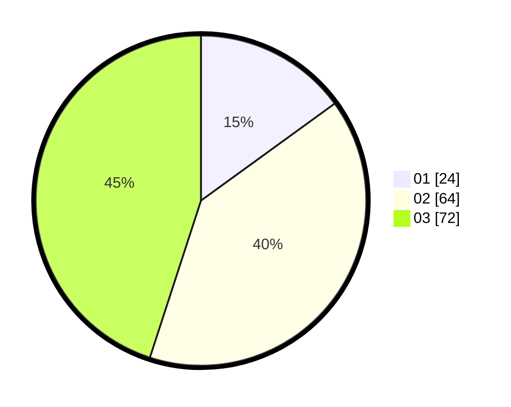

# Hasil

Hasil perolehan suara paslon dapat dilihat pada file paslon-01.txt, paslon-02.txt, dan paslon-03.txt.

Jika tidak ada, artinya data tersebut belum ada pada SIREKAP.

## Perolehan Suara

 * Paslon 01: **24**.
 * Paslon 02: **64**.
 * Paslon 03: **72**.

## Foto C Plano

https://sirekap-obj-formc.kpu.go.id/d962/pemilu/ppwp/31/71/03/10/02/3171031002082-20240214-155543--583cab17-da36-469f-ad30-81916e1a0cb0.jpg

https://sirekap-obj-formc.kpu.go.id/d962/pemilu/ppwp/31/71/03/10/02/3171031002082-20240214-155633--e84f376f-48e9-4543-b2a8-c0fd0b868bc0.jpg

https://sirekap-obj-formc.kpu.go.id/d962/pemilu/ppwp/31/71/03/10/02/3171031002082-20240214-155702--d7bc1e60-a613-4a97-86f6-5e36586a64ec.jpg

## DATA PEMILIH TETAP

Jumlah pemilih dalam DPT: **240**.
 * L: **105**.
 * P: **135**.

## DATA PENGGUNA HAK PILIH

Jumlah pengguna hak pilih dalam DPT: **140**.
 * L: **66**.
 * P: **74**.

Jumlah pengguna hak pilih dalam DPTb: **5**.
 * L: **2**.
 * P: **3**.

Jumlah pengguna hak pilih dalam DPK: **17**.
 * L: **10**.
 * P: **7**.

Jumlah pengguna hak pilih: **162**.
 * L: **78**.
 * P: **84**.

## JUMLAH SUARA SAH DAN TIDAK SAH

JUMLAH SELURUH SUARA SAH: **160**.

JUMLAH SUARA TIDAK SAH: **2**.

JUMLAH SELURUH SUARA SAH DAN SUARA TIDAK SAH: **162**.
