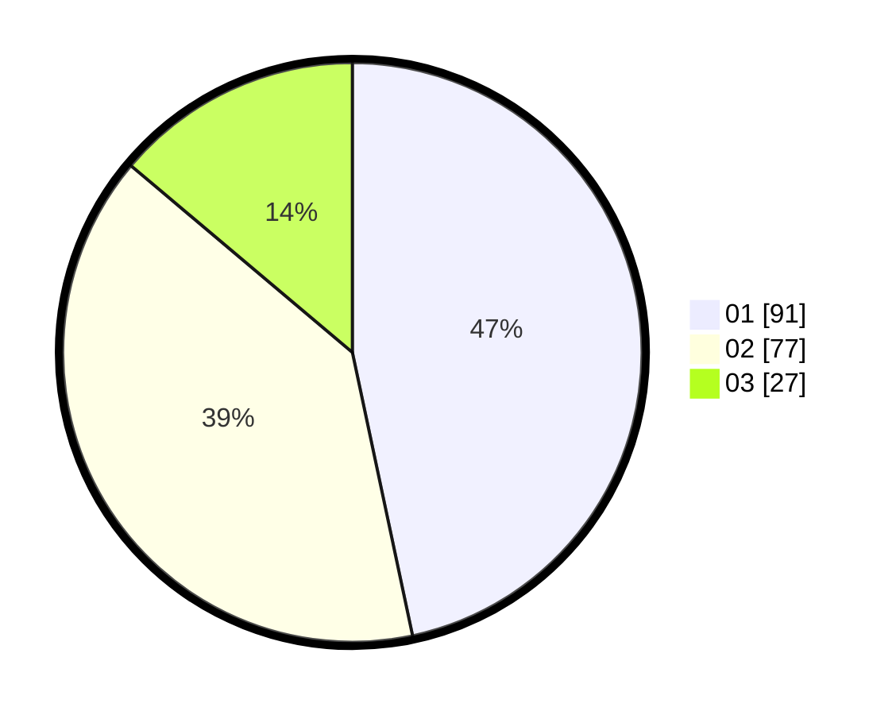

# Hasil

Hasil perolehan suara paslon dapat dilihat pada file paslon-01.txt, paslon-02.txt, dan paslon-03.txt.

Jika tidak ada, artinya data tersebut belum ada pada SIREKAP.

## Perolehan Suara

 * Paslon 01: **91**.
 * Paslon 02: **77**.
 * Paslon 03: **27**.

## Foto C Plano

https://sirekap-obj-formc.kpu.go.id/24ba/pemilu/ppwp/31/71/03/10/02/3171031002083-20240216-135520--5a092e16-eb3d-4f2d-8292-993cfff074d6.jpg

https://sirekap-obj-formc.kpu.go.id/24ba/pemilu/ppwp/31/71/03/10/02/3171031002083-20240216-153207--b50ec3b6-1f7a-469b-a3ce-1d80f9cf8d2c.jpg

https://sirekap-obj-formc.kpu.go.id/24ba/pemilu/ppwp/31/71/03/10/02/3171031002083-20240216-153831--313fe18e-0edc-4ee2-b305-b02576f084e3.jpg

## DATA PEMILIH TETAP

Jumlah pemilih dalam DPT: **194**.
 * L: **87**.
 * P: **107**.

## DATA PENGGUNA HAK PILIH

Jumlah pengguna hak pilih dalam DPT: **194**.
 * L: **87**.
 * P: **107**.

Jumlah pengguna hak pilih dalam DPTb: **0**.
 * L: **0**.
 * P: **0**.

Jumlah pengguna hak pilih dalam DPK: **4**.
 * L: **1**.
 * P: **3**.

Jumlah pengguna hak pilih: **198**.
 * L: **88**.
 * P: **110**.

## JUMLAH SUARA SAH DAN TIDAK SAH

JUMLAH SELURUH SUARA SAH: **195**.

JUMLAH SUARA TIDAK SAH: **3**.

JUMLAH SELURUH SUARA SAH DAN SUARA TIDAK SAH: **198**.
