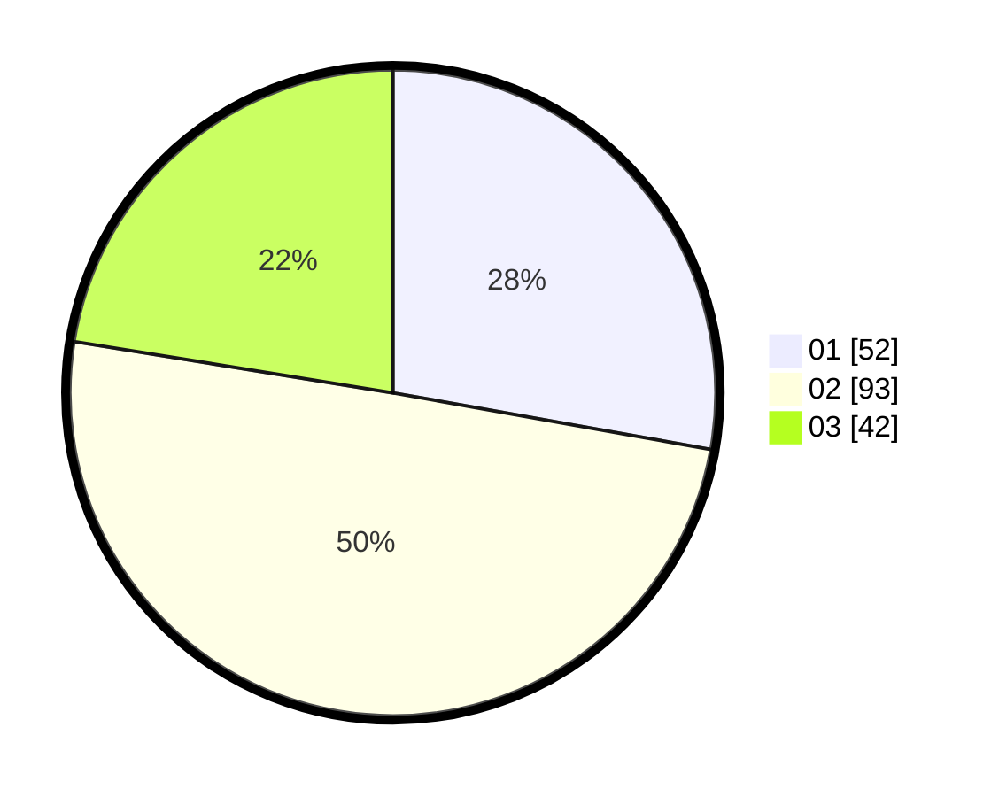

# Hasil

Hasil perolehan suara paslon dapat dilihat pada file paslon-01.txt, paslon-02.txt, dan paslon-03.txt.

Jika tidak ada, artinya data tersebut belum ada pada SIREKAP.

## Perolehan Suara

 * Paslon 01: **52**.
 * Paslon 02: **93**.
 * Paslon 03: **42**.

## Foto C Plano

https://sirekap-obj-formc.kpu.go.id/b570/pemilu/ppwp/31/71/03/10/02/3171031002084-20240216-103440--5be2c852-0e93-4e08-9916-603c4dd92db5.jpg

https://sirekap-obj-formc.kpu.go.id/b570/pemilu/ppwp/31/71/03/10/02/3171031002084-20240216-103508--a38ab818-f0d8-4cad-b6e0-e011c9d004c2.jpg

https://sirekap-obj-formc.kpu.go.id/b570/pemilu/ppwp/31/71/03/10/02/3171031002084-20240216-103516--41bd9652-e110-4beb-9c83-774711c6cc34.jpg

## DATA PEMILIH TETAP

Jumlah pemilih dalam DPT: **287**.
 * L: **124**.
 * P: **163**.

## DATA PENGGUNA HAK PILIH

Jumlah pengguna hak pilih dalam DPT: **190**.
 * L: **77**.
 * P: **113**.

Jumlah pengguna hak pilih dalam DPTb: **0**.
 * L: **0**.
 * P: **0**.

Jumlah pengguna hak pilih dalam DPK: **0**.
 * L: **0**.
 * P: **0**.

Jumlah pengguna hak pilih: **190**.
 * L: **77**.
 * P: **113**.

## JUMLAH SUARA SAH DAN TIDAK SAH

JUMLAH SELURUH SUARA SAH: **187**.

JUMLAH SUARA TIDAK SAH: **3**.

JUMLAH SELURUH SUARA SAH DAN SUARA TIDAK SAH: **190**.
