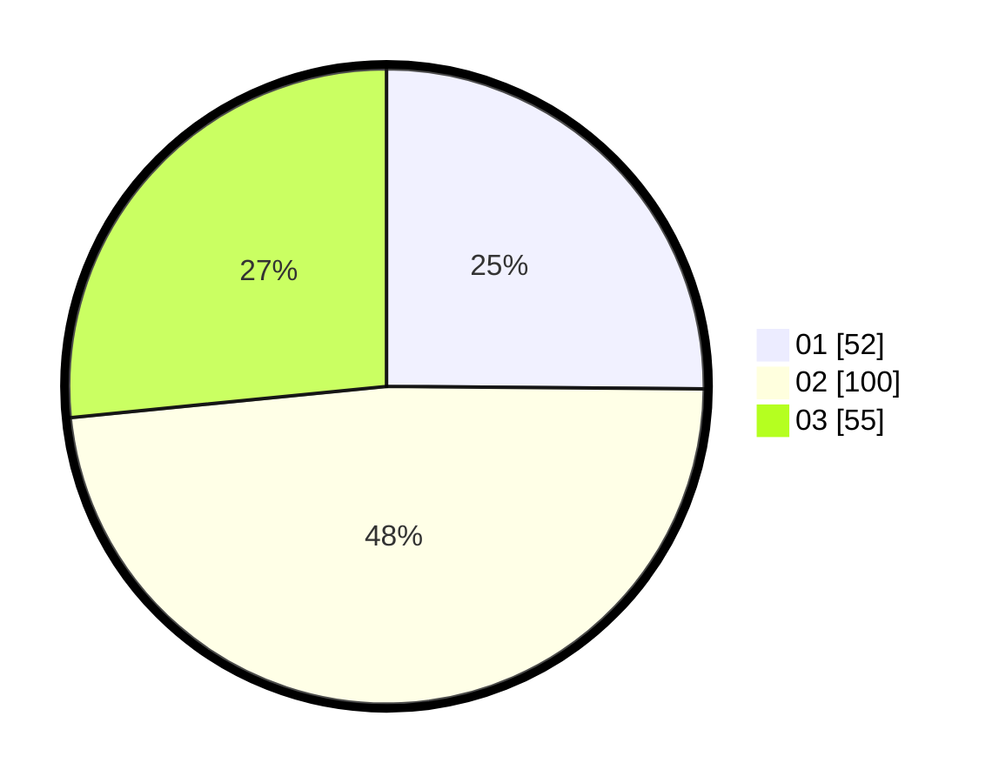

# Hasil

Hasil perolehan suara paslon dapat dilihat pada file paslon-01.txt, paslon-02.txt, dan paslon-03.txt.

Jika tidak ada, artinya data tersebut belum ada pada SIREKAP.

## Perolehan Suara

 * Paslon 01: **52**.
 * Paslon 02: **100**.
 * Paslon 03: **55**.

## Foto C Plano

https://sirekap-obj-formc.kpu.go.id/a1d6/pemilu/ppwp/31/71/03/10/02/3171031002087-20240215-154717--ed647fa3-2d4a-4434-98cb-e7123bd21df1.jpg

https://sirekap-obj-formc.kpu.go.id/a1d6/pemilu/ppwp/31/71/03/10/02/3171031002087-20240215-154910--dbb1a1f8-1614-40be-ba88-ee45d4db9537.jpg

https://sirekap-obj-formc.kpu.go.id/a1d6/pemilu/ppwp/31/71/03/10/02/3171031002087-20240215-155328--8083598c-3afa-4f5c-bbfb-ee7e0f0b7d4c.jpg

## DATA PEMILIH TETAP

Jumlah pemilih dalam DPT: **273**.
 * L: **134**.
 * P: **139**.

## DATA PENGGUNA HAK PILIH

Jumlah pengguna hak pilih dalam DPT: **206**.
 * L: **96**.
 * P: **110**.

Jumlah pengguna hak pilih dalam DPTb: **0**.
 * L: **0**.
 * P: **0**.

Jumlah pengguna hak pilih dalam DPK: **2**.
 * L: **0**.
 * P: **2**.

Jumlah pengguna hak pilih: **208**.
 * L: **96**.
 * P: **112**.

## JUMLAH SUARA SAH DAN TIDAK SAH

JUMLAH SELURUH SUARA SAH: **207**.

JUMLAH SUARA TIDAK SAH: **1**.

JUMLAH SELURUH SUARA SAH DAN SUARA TIDAK SAH: **208**.
