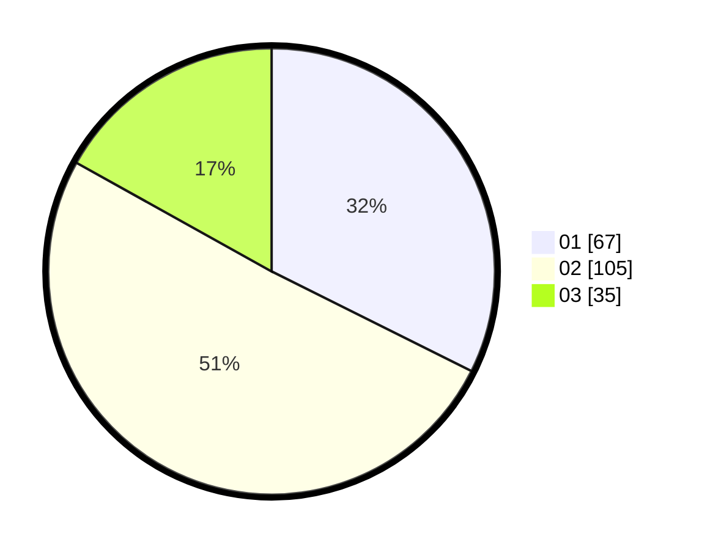

# Hasil

Hasil perolehan suara paslon dapat dilihat pada file paslon-01.txt, paslon-02.txt, dan paslon-03.txt.

Jika tidak ada, artinya data tersebut belum ada pada SIREKAP.

## Perolehan Suara

 * Paslon 01: **67**.
 * Paslon 02: **105**.
 * Paslon 03: **35**.

## Foto C Plano

https://sirekap-obj-formc.kpu.go.id/0614/pemilu/ppwp/31/71/03/10/02/3171031002088-20240217-164031--3a835dd9-7eb6-47e4-bc27-50f9d088de77.jpg

https://sirekap-obj-formc.kpu.go.id/0614/pemilu/ppwp/31/71/03/10/02/3171031002088-20240217-164033--52e0ba54-b437-4e2a-9436-93648e0cda8e.jpg

https://sirekap-obj-formc.kpu.go.id/0614/pemilu/ppwp/31/71/03/10/02/3171031002088-20240217-164032--858a3a25-5a83-4149-9c15-d7ab07d562df.jpg

## DATA PEMILIH TETAP

Jumlah pemilih dalam DPT: **278**.
 * L: **145**.
 * P: **133**.

## DATA PENGGUNA HAK PILIH

Jumlah pengguna hak pilih dalam DPT: **204**.
 * L: **108**.
 * P: **96**.

Jumlah pengguna hak pilih dalam DPTb: **1**.
 * L: **1**.
 * P: **0**.

Jumlah pengguna hak pilih dalam DPK: **2**.
 * L: **2**.
 * P: **0**.

Jumlah pengguna hak pilih: **207**.
 * L: **111**.
 * P: **96**.

## JUMLAH SUARA SAH DAN TIDAK SAH

JUMLAH SELURUH SUARA SAH: **207**.

JUMLAH SUARA TIDAK SAH: **0**.

JUMLAH SELURUH SUARA SAH DAN SUARA TIDAK SAH: **207**.
