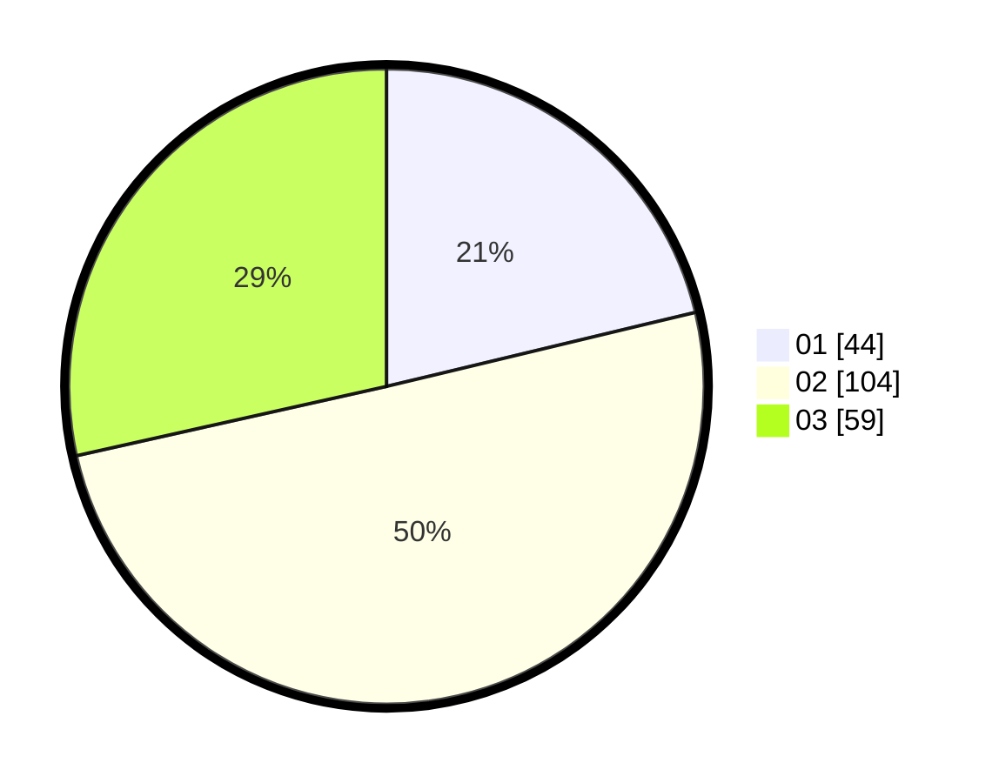

# Hasil

Hasil perolehan suara paslon dapat dilihat pada file paslon-01.txt, paslon-02.txt, dan paslon-03.txt.

Jika tidak ada, artinya data tersebut belum ada pada SIREKAP.

## Perolehan Suara

 * Paslon 01: **44**.
 * Paslon 02: **104**.
 * Paslon 03: **59**.

## Foto C Plano

https://sirekap-obj-formc.kpu.go.id/73a8/pemilu/ppwp/31/71/03/10/02/3171031002091-20240216-094943--7c69d19e-3133-43f0-94f5-1da5acf32b6d.jpg

https://sirekap-obj-formc.kpu.go.id/73a8/pemilu/ppwp/31/71/03/10/02/3171031002091-20240216-094952--05e884b5-bb7e-4e0f-a076-fa211054ab8d.jpg

https://sirekap-obj-formc.kpu.go.id/73a8/pemilu/ppwp/31/71/03/10/02/3171031002091-20240216-094948--17e07a7f-32b9-4dc2-a124-e89a71728eda.jpg

## DATA PEMILIH TETAP

Jumlah pemilih dalam DPT: **276**.
 * L: **131**.
 * P: **145**.

## DATA PENGGUNA HAK PILIH

Jumlah pengguna hak pilih dalam DPT: **192**.
 * L: **92**.
 * P: **100**.

Jumlah pengguna hak pilih dalam DPTb: **13**.
 * L: **6**.
 * P: **7**.

Jumlah pengguna hak pilih dalam DPK: **4**.
 * L: **3**.
 * P: **1**.

Jumlah pengguna hak pilih: **209**.
 * L: **101**.
 * P: **108**.

## JUMLAH SUARA SAH DAN TIDAK SAH

JUMLAH SELURUH SUARA SAH: **207**.

JUMLAH SUARA TIDAK SAH: **2**.

JUMLAH SELURUH SUARA SAH DAN SUARA TIDAK SAH: **209**.
