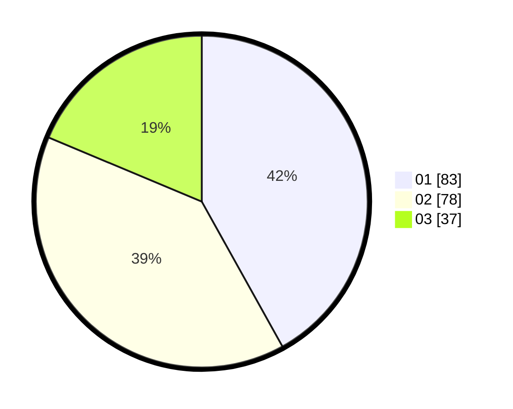

# Hasil

Hasil perolehan suara paslon dapat dilihat pada file paslon-01.txt, paslon-02.txt, dan paslon-03.txt.

Jika tidak ada, artinya data tersebut belum ada pada SIREKAP.

## Perolehan Suara

 * Paslon 01: **83**.
 * Paslon 02: **78**.
 * Paslon 03: **37**.

## Foto C Plano

https://sirekap-obj-formc.kpu.go.id/5096/pemilu/ppwp/31/71/03/10/02/3171031002096-20240214-230031--861de997-9b3b-4615-84b5-1a5032662c68.jpg

https://sirekap-obj-formc.kpu.go.id/5096/pemilu/ppwp/31/71/03/10/02/3171031002096-20240214-194832--27d21ae9-9068-4c32-8e5e-db34d7bfc7b8.jpg

https://sirekap-obj-formc.kpu.go.id/5096/pemilu/ppwp/31/71/03/10/02/3171031002096-20240214-225054--c9287090-07f8-4a1e-8370-6d4905acc7a0.jpg
