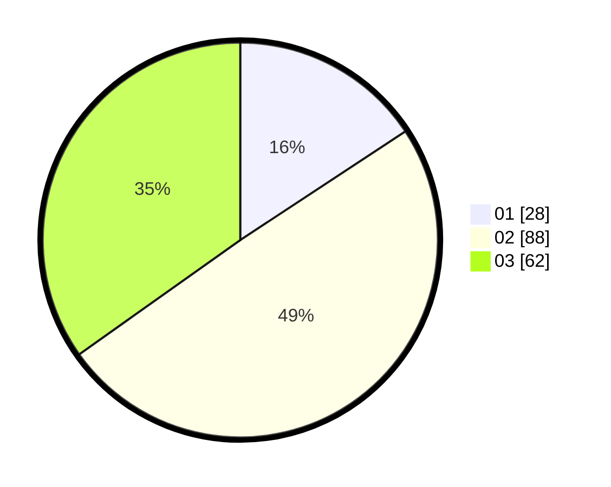

# Hasil

Hasil perolehan suara paslon dapat dilihat pada file paslon-01.txt, paslon-02.txt, dan paslon-03.txt.

Jika tidak ada, artinya data tersebut belum ada pada SIREKAP.

## Perolehan Suara

 * Paslon 01: **28**.
 * Paslon 02: **88**.
 * Paslon 03: **62**.

## Foto C Plano

https://sirekap-obj-formc.kpu.go.id/3eab/pemilu/ppwp/31/71/03/10/02/3171031002099-20240214-214638--cd4b68fb-7ad3-4ec9-bdff-df5d8bdf5815.jpg

https://sirekap-obj-formc.kpu.go.id/3eab/pemilu/ppwp/31/71/03/10/02/3171031002099-20240214-214758--134d969b-0b05-4505-a9a7-c56746c51825.jpg

https://sirekap-obj-formc.kpu.go.id/3eab/pemilu/ppwp/31/71/03/10/02/3171031002099-20240214-214911--02ef9bd2-ce68-4b62-aaa5-b26f1ce0fc1c.jpg
