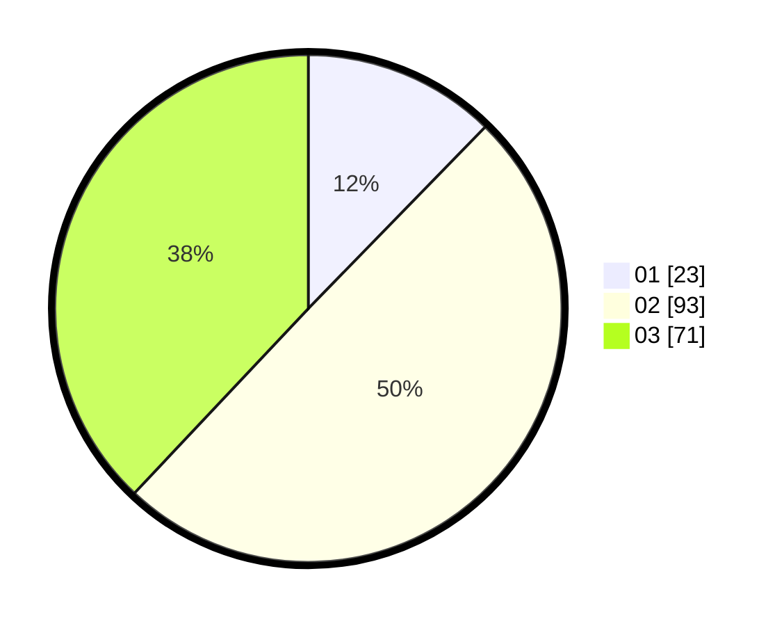

# Hasil

Hasil perolehan suara paslon dapat dilihat pada file paslon-01.txt, paslon-02.txt, dan paslon-03.txt.

Jika tidak ada, artinya data tersebut belum ada pada SIREKAP.

## Perolehan Suara

 * Paslon 01: **23**.
 * Paslon 02: **93**.
 * Paslon 03: **71**.

## Foto C Plano

https://sirekap-obj-formc.kpu.go.id/8a9d/pemilu/ppwp/31/71/03/10/02/3171031002100-20240219-151736--0c7c51a7-b438-48c7-9f7a-7d43e5488189.jpg

https://sirekap-obj-formc.kpu.go.id/8a9d/pemilu/ppwp/31/71/03/10/02/3171031002100-20240216-163054--44095aff-efea-41f2-97c7-be9b1e17351d.jpg

https://sirekap-obj-formc.kpu.go.id/8a9d/pemilu/ppwp/31/71/03/10/02/3171031002100-20240215-163354--bdb4bdd7-8080-4eeb-875d-64eef0fb9448.jpg
