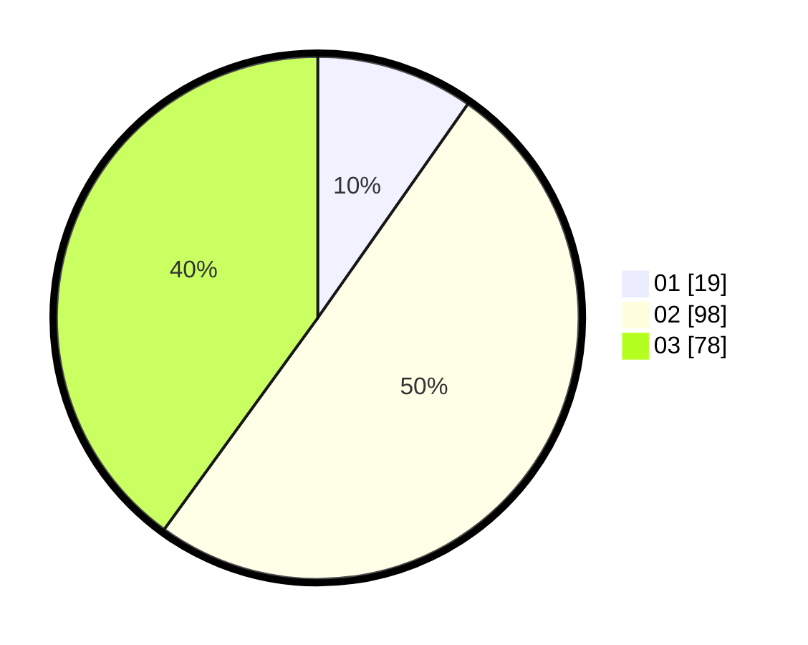

# Hasil

Hasil perolehan suara paslon dapat dilihat pada file paslon-01.txt, paslon-02.txt, dan paslon-03.txt.

Jika tidak ada, artinya data tersebut belum ada pada SIREKAP.

## Perolehan Suara

 * Paslon 01: **19**.
 * Paslon 02: **98**.
 * Paslon 03: **78**.

## Foto C Plano

https://sirekap-obj-formc.kpu.go.id/1cae/pemilu/ppwp/31/71/03/10/02/3171031002101-20240214-195511--c85fb57c-d437-41ea-af50-6b6196a5998b.jpg

https://sirekap-obj-formc.kpu.go.id/1cae/pemilu/ppwp/31/71/03/10/02/3171031002101-20240214-202238--46508181-9e09-4a47-b697-beda5babe092.jpg

https://sirekap-obj-formc.kpu.go.id/1cae/pemilu/ppwp/31/71/03/10/02/3171031002101-20240214-195824--396c84b7-2f5f-49b4-934d-b5a0f6038c1c.jpg

## DATA PEMILIH TETAP

Jumlah pemilih dalam DPT: **284**.
 * L: **117**.
 * P: **167**.

## DATA PENGGUNA HAK PILIH

Jumlah pengguna hak pilih dalam DPT: **174**.
 * L: **73**.
 * P: **101**.

Jumlah pengguna hak pilih dalam DPTb: **17**.
 * L: **9**.
 * P: **8**.

Jumlah pengguna hak pilih dalam DPK: **6**.
 * L: **4**.
 * P: **2**.

Jumlah pengguna hak pilih: **197**.
 * L: **86**.
 * P: **111**.

## JUMLAH SUARA SAH DAN TIDAK SAH

JUMLAH SELURUH SUARA SAH: **195**.

JUMLAH SUARA TIDAK SAH: **2**.

JUMLAH SELURUH SUARA SAH DAN SUARA TIDAK SAH: **197**.
