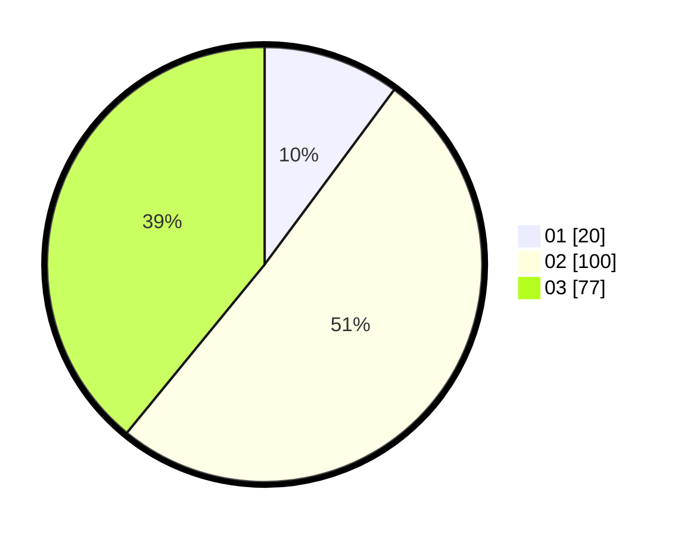

# Hasil

Hasil perolehan suara paslon dapat dilihat pada file paslon-01.txt, paslon-02.txt, dan paslon-03.txt.

Jika tidak ada, artinya data tersebut belum ada pada SIREKAP.

## Perolehan Suara

 * Paslon 01: **20**.
 * Paslon 02: **100**.
 * Paslon 03: **77**.

## Foto C Plano

https://sirekap-obj-formc.kpu.go.id/522e/pemilu/ppwp/31/71/03/10/02/3171031002102-20240216-181305--e4076fdf-1737-4807-8b9d-1bc28a0ad850.jpg

https://sirekap-obj-formc.kpu.go.id/522e/pemilu/ppwp/31/71/03/10/02/3171031002102-20240216-100559--24353e32-fc1e-4199-84de-0c806c7e6f6e.jpg

https://sirekap-obj-formc.kpu.go.id/522e/pemilu/ppwp/31/71/03/10/02/3171031002102-20240216-181221--35eb26cc-9341-40f4-b415-80c8f5ae521c.jpg
