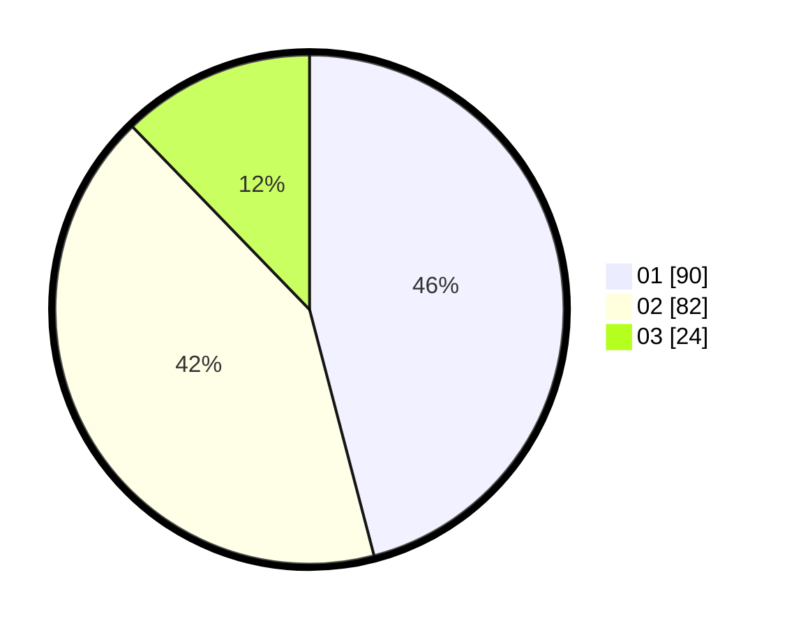

# Hasil

Hasil perolehan suara paslon dapat dilihat pada file paslon-01.txt, paslon-02.txt, dan paslon-03.txt.

Jika tidak ada, artinya data tersebut belum ada pada SIREKAP.

## Perolehan Suara

 * Paslon 01: **90**.
 * Paslon 02: **82**.
 * Paslon 03: **24**.

## Foto C Plano

https://sirekap-obj-formc.kpu.go.id/87c5/pemilu/ppwp/31/71/03/10/03/3171031003001-20240216-170806--67662d1d-9334-41b5-b854-2f565753da8a.jpg

https://sirekap-obj-formc.kpu.go.id/87c5/pemilu/ppwp/31/71/03/10/03/3171031003001-20240216-171030--c1593866-264c-4054-8d6b-74f1c2431221.jpg

https://sirekap-obj-formc.kpu.go.id/87c5/pemilu/ppwp/31/71/03/10/03/3171031003001-20240216-170651--9eba6e7d-301b-4637-8c89-9d6a4cb5eb7c.jpg

## DATA PEMILIH TETAP

Jumlah pemilih dalam DPT: **276**.
 * L: **141**.
 * P: **135**.

## DATA PENGGUNA HAK PILIH

Jumlah pengguna hak pilih dalam DPT: **188**.
 * L: **93**.
 * P: **95**.

Jumlah pengguna hak pilih dalam DPTb: **3**.
 * L: **1**.
 * P: **2**.

Jumlah pengguna hak pilih dalam DPK: **7**.
 * L: **2**.
 * P: **5**.

Jumlah pengguna hak pilih: **198**.
 * L: **96**.
 * P: **102**.

## JUMLAH SUARA SAH DAN TIDAK SAH

JUMLAH SELURUH SUARA SAH: **196**.

JUMLAH SUARA TIDAK SAH: **3**.

JUMLAH SELURUH SUARA SAH DAN SUARA TIDAK SAH: **199**.
