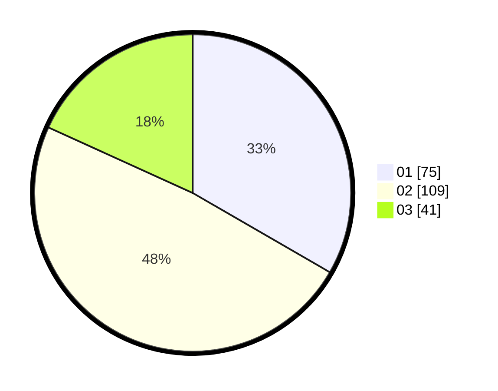

# Hasil

Hasil perolehan suara paslon dapat dilihat pada file paslon-01.txt, paslon-02.txt, dan paslon-03.txt.

Jika tidak ada, artinya data tersebut belum ada pada SIREKAP.

## Perolehan Suara

 * Paslon 01: **75**.
 * Paslon 02: **109**.
 * Paslon 03: **41**.

## Foto C Plano

https://sirekap-obj-formc.kpu.go.id/79fd/pemilu/ppwp/31/71/03/10/03/3171031003003-20240216-203427--ee8f6dd0-1468-4d37-93c4-0e444caaad38.jpg

https://sirekap-obj-formc.kpu.go.id/79fd/pemilu/ppwp/31/71/03/10/03/3171031003003-20240216-203136--aeb64fdc-e885-4a8c-845e-c283d785d602.jpg

https://sirekap-obj-formc.kpu.go.id/79fd/pemilu/ppwp/31/71/03/10/03/3171031003003-20240216-203320--243c7928-b635-4362-8bd1-ea45afd780e5.jpg
