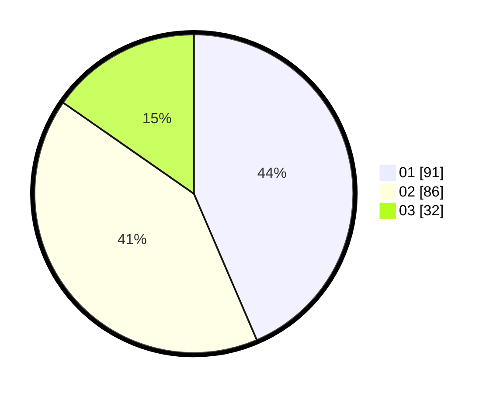

# Hasil

Hasil perolehan suara paslon dapat dilihat pada file paslon-01.txt, paslon-02.txt, dan paslon-03.txt.

Jika tidak ada, artinya data tersebut belum ada pada SIREKAP.

## Perolehan Suara

 * Paslon 01: **91**.
 * Paslon 02: **86**.
 * Paslon 03: **32**.

## Foto C Plano

https://sirekap-obj-formc.kpu.go.id/81eb/pemilu/ppwp/31/71/03/10/03/3171031003004-20240216-021238--3b0701bd-bbc1-4188-b84c-579a808367d3.jpg

https://sirekap-obj-formc.kpu.go.id/81eb/pemilu/ppwp/31/71/03/10/03/3171031003004-20240216-021244--22fa7fea-f832-4ca7-8f3c-0543fda62873.jpg

https://sirekap-obj-formc.kpu.go.id/81eb/pemilu/ppwp/31/71/03/10/03/3171031003004-20240216-021239--8910b7f4-8dcb-4022-b141-56b0e28f7923.jpg

## DATA PEMILIH TETAP

Jumlah pemilih dalam DPT: **283**.
 * L: **131**.
 * P: **152**.

## DATA PENGGUNA HAK PILIH

Jumlah pengguna hak pilih dalam DPT: **206**.
 * L: **89**.
 * P: **117**.

Jumlah pengguna hak pilih dalam DPTb: **0**.
 * L: **0**.
 * P: **0**.

Jumlah pengguna hak pilih dalam DPK: **4**.
 * L: **3**.
 * P: **1**.

Jumlah pengguna hak pilih: **210**.
 * L: **92**.
 * P: **118**.

## JUMLAH SUARA SAH DAN TIDAK SAH

JUMLAH SELURUH SUARA SAH: **209**.

JUMLAH SUARA TIDAK SAH: **1**.

JUMLAH SELURUH SUARA SAH DAN SUARA TIDAK SAH: **210**.
