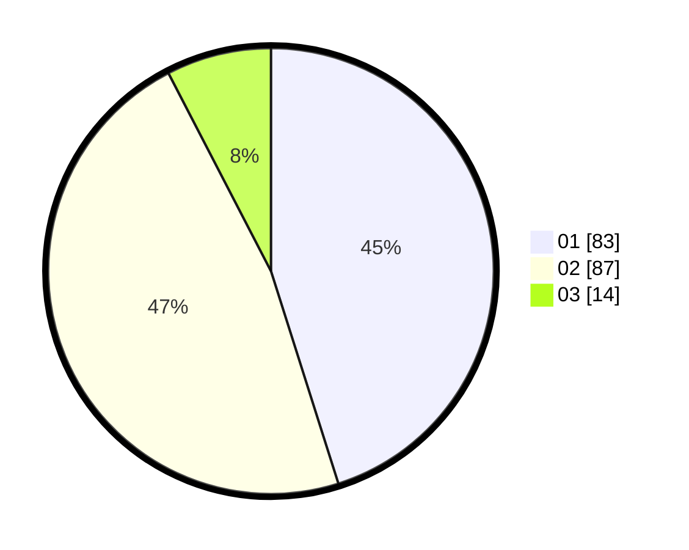

# Hasil

Hasil perolehan suara paslon dapat dilihat pada file paslon-01.txt, paslon-02.txt, dan paslon-03.txt.

Jika tidak ada, artinya data tersebut belum ada pada SIREKAP.

## Perolehan Suara

 * Paslon 01: **83**.
 * Paslon 02: **87**.
 * Paslon 03: **14**.

## Foto C Plano

https://sirekap-obj-formc.kpu.go.id/6b90/pemilu/ppwp/31/71/03/10/03/3171031003005-20240216-153611--18657035-ebb4-4dc7-9abd-8fdc63b22965.jpg

https://sirekap-obj-formc.kpu.go.id/6b90/pemilu/ppwp/31/71/03/10/03/3171031003005-20240216-153612--1be0a47b-1a26-407e-ab1b-78cb191471f1.jpg

https://sirekap-obj-formc.kpu.go.id/6b90/pemilu/ppwp/31/71/03/10/03/3171031003005-20240216-153611--8598411c-3f7a-4e1c-8c69-849c3eba703b.jpg

## DATA PEMILIH TETAP

Jumlah pemilih dalam DPT: **271**.
 * L: **138**.
 * P: **133**.

## DATA PENGGUNA HAK PILIH

Jumlah pengguna hak pilih dalam DPT: **180**.
 * L: **92**.
 * P: **88**.

Jumlah pengguna hak pilih dalam DPTb: **3**.
 * L: **2**.
 * P: **1**.

Jumlah pengguna hak pilih dalam DPK: **5**.
 * L: **1**.
 * P: **4**.

Jumlah pengguna hak pilih: **188**.
 * L: **95**.
 * P: **93**.

## JUMLAH SUARA SAH DAN TIDAK SAH

JUMLAH SELURUH SUARA SAH: **184**.

JUMLAH SUARA TIDAK SAH: **4**.

JUMLAH SELURUH SUARA SAH DAN SUARA TIDAK SAH: **188**.
