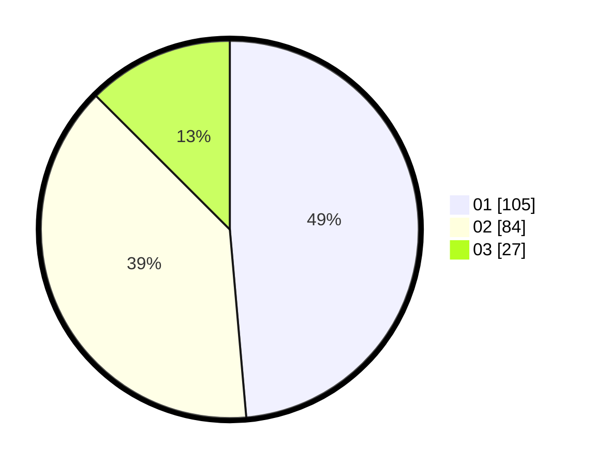

# Hasil

Hasil perolehan suara paslon dapat dilihat pada file paslon-01.txt, paslon-02.txt, dan paslon-03.txt.

Jika tidak ada, artinya data tersebut belum ada pada SIREKAP.

## Perolehan Suara

 * Paslon 01: **105**.
 * Paslon 02: **84**.
 * Paslon 03: **27**.

## Foto C Plano

https://sirekap-obj-formc.kpu.go.id/d99d/pemilu/ppwp/31/71/03/10/03/3171031003007-20240217-020704--692b97d7-6a45-46ef-93f4-8b6b9630adf9.jpg

https://sirekap-obj-formc.kpu.go.id/d99d/pemilu/ppwp/31/71/03/10/03/3171031003007-20240217-021115--0c1435d1-6141-4d02-95b2-4c1ef4d8cdcd.jpg
