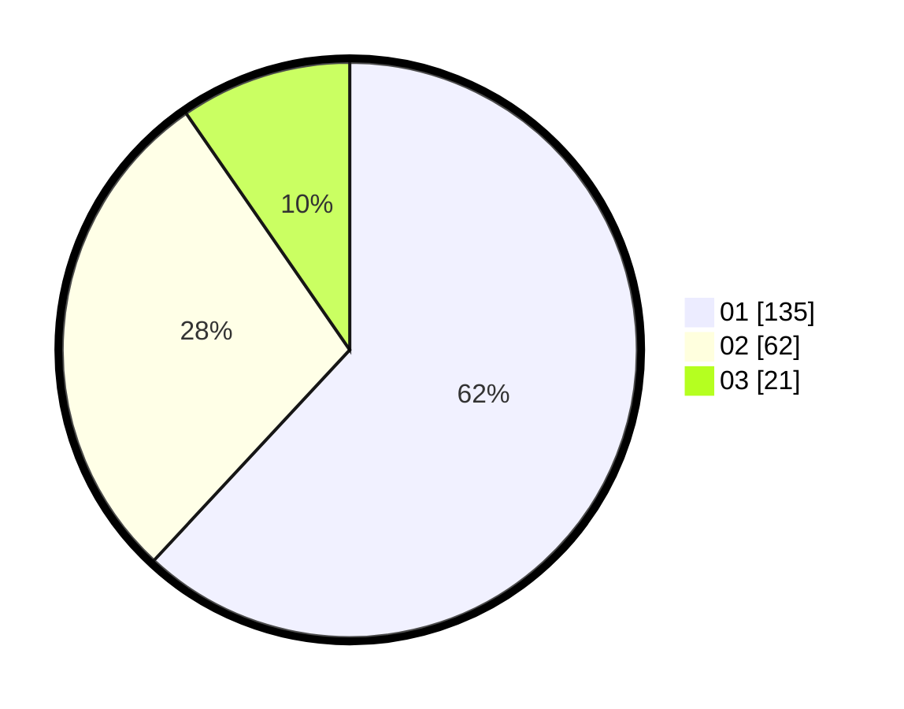

# Hasil

Hasil perolehan suara paslon dapat dilihat pada file paslon-01.txt, paslon-02.txt, dan paslon-03.txt.

Jika tidak ada, artinya data tersebut belum ada pada SIREKAP.

## Perolehan Suara

 * Paslon 01: **135**.
 * Paslon 02: **62**.
 * Paslon 03: **21**.

## Foto C Plano

https://sirekap-obj-formc.kpu.go.id/0c48/pemilu/ppwp/31/71/03/10/03/3171031003008-20240216-124206--613ed043-377c-4f34-b6a6-dbca06b62acc.jpg

https://sirekap-obj-formc.kpu.go.id/0c48/pemilu/ppwp/31/71/03/10/03/3171031003008-20240216-124212--26f30eaf-151c-4aff-8ab8-bb6c2175bbe8.jpg

https://sirekap-obj-formc.kpu.go.id/0c48/pemilu/ppwp/31/71/03/10/03/3171031003008-20240216-124211--7d371427-f0b5-4af5-80b0-11a7f66644f8.jpg

## DATA PEMILIH TETAP

Jumlah pemilih dalam DPT: **0**.
 * L: **0**.
 * P: **0**.

## DATA PENGGUNA HAK PILIH

Jumlah pengguna hak pilih dalam DPT: **0**.
 * L: **0**.
 * P: **0**.

Jumlah pengguna hak pilih dalam DPTb: **0**.
 * L: **0**.
 * P: **0**.

Jumlah pengguna hak pilih dalam DPK: **0**.
 * L: **0**.
 * P: **0**.

Jumlah pengguna hak pilih: **0**.
 * L: **0**.
 * P: **0**.

## JUMLAH SUARA SAH DAN TIDAK SAH

JUMLAH SELURUH SUARA SAH: **218**.

JUMLAH SUARA TIDAK SAH: **4**.

JUMLAH SELURUH SUARA SAH DAN SUARA TIDAK SAH: **222**.
