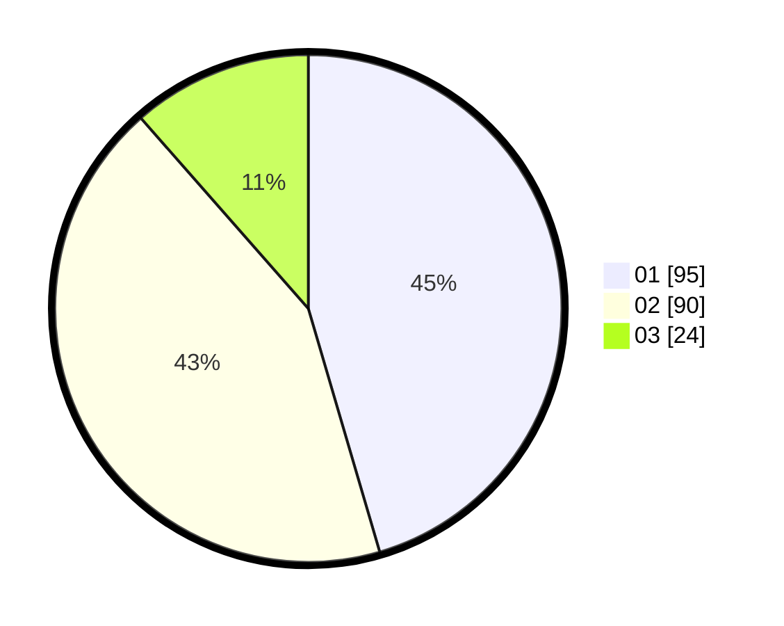

# Hasil

Hasil perolehan suara paslon dapat dilihat pada file paslon-01.txt, paslon-02.txt, dan paslon-03.txt.

Jika tidak ada, artinya data tersebut belum ada pada SIREKAP.

## Perolehan Suara

 * Paslon 01: **95**.
 * Paslon 02: **90**.
 * Paslon 03: **24**.

## Foto C Plano

https://sirekap-obj-formc.kpu.go.id/861f/pemilu/ppwp/31/71/03/10/03/3171031003009-20240214-210835--41dd3b49-1513-4508-a783-2c118da05fa3.jpg

https://sirekap-obj-formc.kpu.go.id/861f/pemilu/ppwp/31/71/03/10/03/3171031003009-20240214-211322--c9c41e8e-314b-42af-acec-3baa384b8b91.jpg

https://sirekap-obj-formc.kpu.go.id/861f/pemilu/ppwp/31/71/03/10/03/3171031003009-20240217-121648--308a33fc-4cf2-48ad-9f39-1ff6c23c1915.jpg
