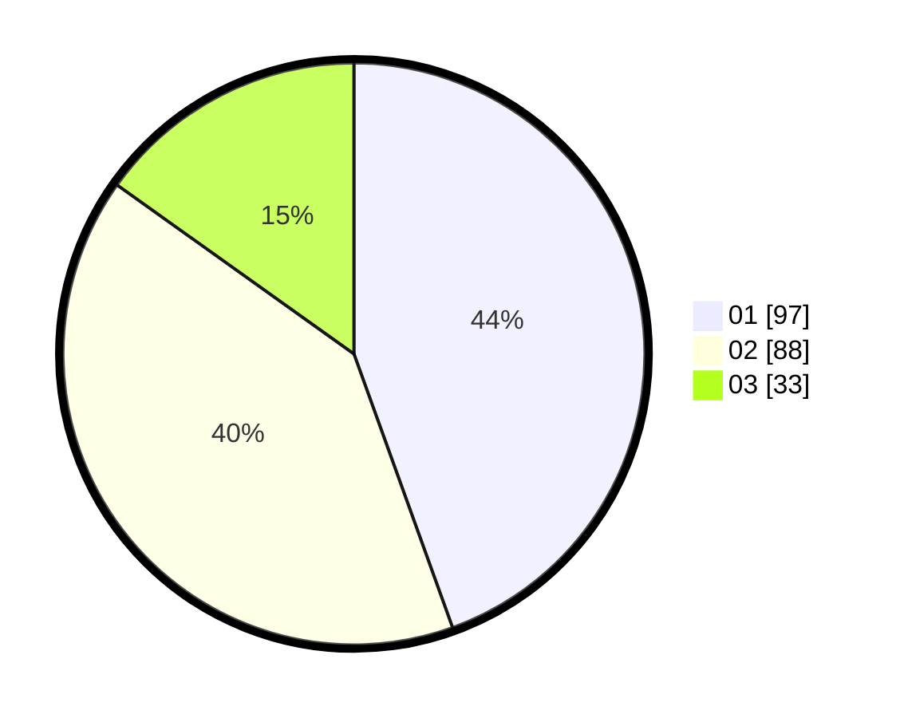

# Hasil

Hasil perolehan suara paslon dapat dilihat pada file paslon-01.txt, paslon-02.txt, dan paslon-03.txt.

Jika tidak ada, artinya data tersebut belum ada pada SIREKAP.

## Perolehan Suara

 * Paslon 01: **97**.
 * Paslon 02: **88**.
 * Paslon 03: **33**.

## Foto C Plano

https://sirekap-obj-formc.kpu.go.id/f030/pemilu/ppwp/31/71/03/10/03/3171031003015-20240216-165902--77f18e60-b40c-4e0f-b988-dbe58567d8db.jpg

https://sirekap-obj-formc.kpu.go.id/f030/pemilu/ppwp/31/71/03/10/03/3171031003015-20240214-230355--9844e125-9cba-491b-8f0c-97291046ba0b.jpg

https://sirekap-obj-formc.kpu.go.id/f030/pemilu/ppwp/31/71/03/10/03/3171031003015-20240216-165903--c84202f0-e31b-4d33-aec5-8069473974e2.jpg

## DATA PEMILIH TETAP

Jumlah pemilih dalam DPT: **216**.
 * L: **111**.
 * P: **105**.

## DATA PENGGUNA HAK PILIH

Jumlah pengguna hak pilih dalam DPT: **216**.
 * L: **111**.
 * P: **105**.

Jumlah pengguna hak pilih dalam DPTb: **4**.
 * L: **1**.
 * P: **3**.

Jumlah pengguna hak pilih dalam DPK: **1**.
 * L: **1**.
 * P: **0**.

Jumlah pengguna hak pilih: **221**.
 * L: **113**.
 * P: **108**.

## JUMLAH SUARA SAH DAN TIDAK SAH

JUMLAH SELURUH SUARA SAH: **218**.

JUMLAH SUARA TIDAK SAH: **3**.

JUMLAH SELURUH SUARA SAH DAN SUARA TIDAK SAH: **221**.
