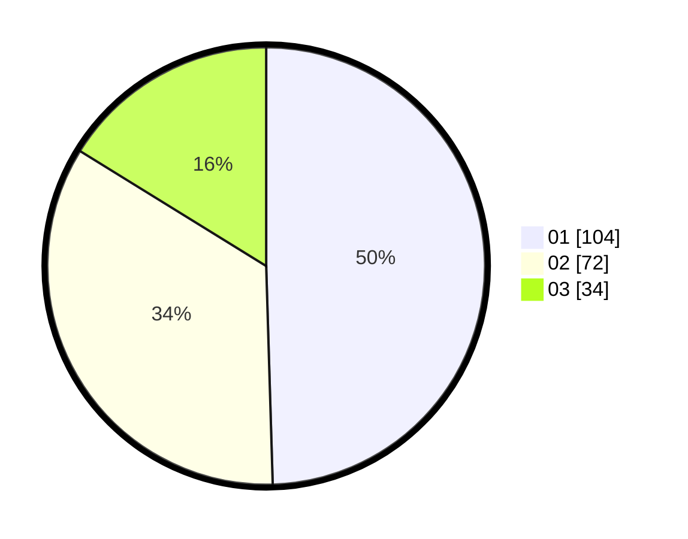

# Hasil

Hasil perolehan suara paslon dapat dilihat pada file paslon-01.txt, paslon-02.txt, dan paslon-03.txt.

Jika tidak ada, artinya data tersebut belum ada pada SIREKAP.

## Perolehan Suara

 * Paslon 01: **104**.
 * Paslon 02: **72**.
 * Paslon 03: **34**.

## Foto C Plano

https://sirekap-obj-formc.kpu.go.id/b800/pemilu/ppwp/31/71/03/10/03/3171031003018-20240216-054058--c00c6ccb-fdcf-4436-923c-3071d22adeaf.jpg

https://sirekap-obj-formc.kpu.go.id/b800/pemilu/ppwp/31/71/03/10/03/3171031003018-20240216-054104--0d6ca20f-0141-4c2c-9432-8bff9c14578b.jpg

https://sirekap-obj-formc.kpu.go.id/b800/pemilu/ppwp/31/71/03/10/03/3171031003018-20240216-054101--c1142995-5d28-4f99-b048-1983e92ed1f1.jpg

## DATA PEMILIH TETAP

Jumlah pemilih dalam DPT: **258**.
 * L: **129**.
 * P: **129**.

## DATA PENGGUNA HAK PILIH

Jumlah pengguna hak pilih dalam DPT: **201**.
 * L: **102**.
 * P: **99**.

Jumlah pengguna hak pilih dalam DPTb: **10**.
 * L: **4**.
 * P: **6**.

Jumlah pengguna hak pilih dalam DPK: **0**.
 * L: **0**.
 * P: **0**.

Jumlah pengguna hak pilih: **211**.
 * L: **106**.
 * P: **105**.

## JUMLAH SUARA SAH DAN TIDAK SAH

JUMLAH SELURUH SUARA SAH: **210**.

JUMLAH SUARA TIDAK SAH: **1**.

JUMLAH SELURUH SUARA SAH DAN SUARA TIDAK SAH: **211**.
