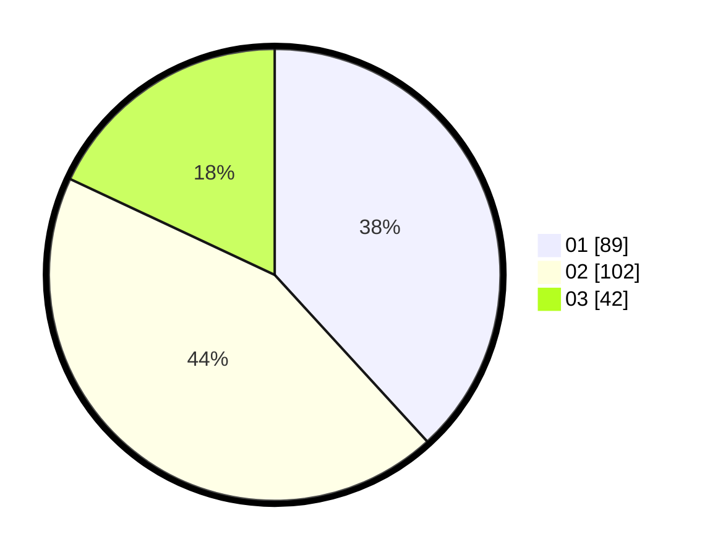

# Hasil

Hasil perolehan suara paslon dapat dilihat pada file paslon-01.txt, paslon-02.txt, dan paslon-03.txt.

Jika tidak ada, artinya data tersebut belum ada pada SIREKAP.

## Perolehan Suara

 * Paslon 01: **89**.
 * Paslon 02: **102**.
 * Paslon 03: **42**.

## Foto C Plano

https://sirekap-obj-formc.kpu.go.id/787c/pemilu/ppwp/31/71/03/10/03/3171031003019-20240216-033816--83a41a81-ee69-444b-bbba-e75536f76cf9.jpg

https://sirekap-obj-formc.kpu.go.id/787c/pemilu/ppwp/31/71/03/10/03/3171031003019-20240216-033829--d3ba543d-108e-4be7-b756-4980ad7ea041.jpg

https://sirekap-obj-formc.kpu.go.id/787c/pemilu/ppwp/31/71/03/10/03/3171031003019-20240216-033821--13b71590-2d37-40fd-9992-c77e22ef442a.jpg

## DATA PEMILIH TETAP

Jumlah pemilih dalam DPT: **282**.
 * L: **136**.
 * P: **146**.

## DATA PENGGUNA HAK PILIH

Jumlah pengguna hak pilih dalam DPT: **230**.
 * L: **108**.
 * P: **122**.

Jumlah pengguna hak pilih dalam DPTb: **2**.
 * L: **0**.
 * P: **2**.

Jumlah pengguna hak pilih dalam DPK: **2**.
 * L: **1**.
 * P: **1**.

Jumlah pengguna hak pilih: **234**.
 * L: **109**.
 * P: **125**.

## JUMLAH SUARA SAH DAN TIDAK SAH

JUMLAH SELURUH SUARA SAH: **233**.

JUMLAH SUARA TIDAK SAH: **1**.

JUMLAH SELURUH SUARA SAH DAN SUARA TIDAK SAH: **234**.
