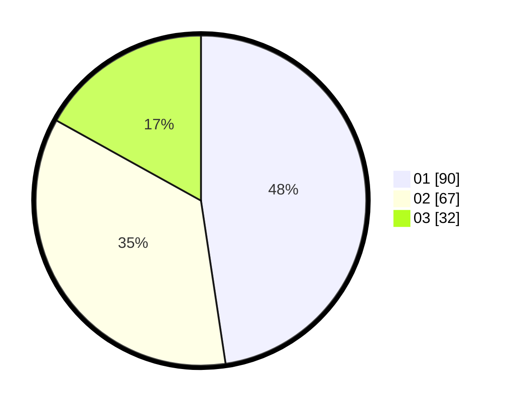

# Hasil

Hasil perolehan suara paslon dapat dilihat pada file paslon-01.txt, paslon-02.txt, dan paslon-03.txt.

Jika tidak ada, artinya data tersebut belum ada pada SIREKAP.

## Perolehan Suara

 * Paslon 01: **90**.
 * Paslon 02: **67**.
 * Paslon 03: **32**.

## Foto C Plano

https://sirekap-obj-formc.kpu.go.id/ba68/pemilu/ppwp/31/71/03/10/03/3171031003024-20240214-205534--524d83c2-5657-4bc0-bd66-001b8e59c27f.jpg

https://sirekap-obj-formc.kpu.go.id/ba68/pemilu/ppwp/31/71/03/10/03/3171031003024-20240214-224359--5495777c-57f9-4427-bee1-4045056b60aa.jpg

https://sirekap-obj-formc.kpu.go.id/ba68/pemilu/ppwp/31/71/03/10/03/3171031003024-20240214-224254--21d9eebe-2228-4f12-b19f-3069bd45886c.jpg
