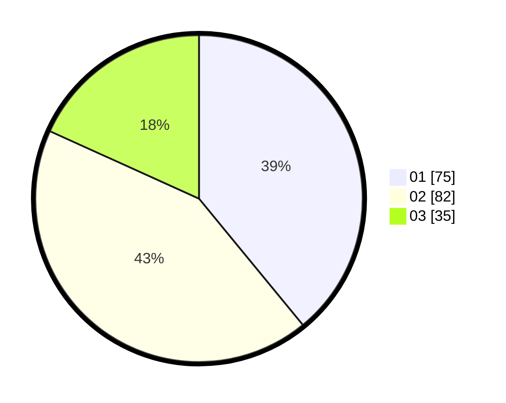

# Hasil

Hasil perolehan suara paslon dapat dilihat pada file paslon-01.txt, paslon-02.txt, dan paslon-03.txt.

Jika tidak ada, artinya data tersebut belum ada pada SIREKAP.

## Perolehan Suara

 * Paslon 01: **75**.
 * Paslon 02: **82**.
 * Paslon 03: **35**.

## Foto C Plano

https://sirekap-obj-formc.kpu.go.id/d3e6/pemilu/ppwp/31/71/03/10/03/3171031003026-20240214-200727--5fc1de3a-33a6-4b7a-9b38-b2bbd4390dc0.jpg

https://sirekap-obj-formc.kpu.go.id/d3e6/pemilu/ppwp/31/71/03/10/03/3171031003026-20240214-202924--4fd85c6d-0bac-4448-90c5-5f3753fc8f94.jpg

https://sirekap-obj-formc.kpu.go.id/d3e6/pemilu/ppwp/31/71/03/10/03/3171031003026-20240214-201033--2785d32f-5d29-497b-8ff4-d91d1892858a.jpg
