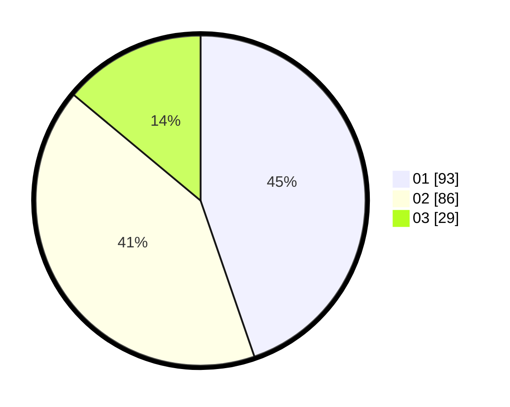

# Hasil

Hasil perolehan suara paslon dapat dilihat pada file paslon-01.txt, paslon-02.txt, dan paslon-03.txt.

Jika tidak ada, artinya data tersebut belum ada pada SIREKAP.

## Perolehan Suara

 * Paslon 01: **93**.
 * Paslon 02: **86**.
 * Paslon 03: **29**.

## Foto C Plano

https://sirekap-obj-formc.kpu.go.id/bbeb/pemilu/ppwp/31/71/03/10/03/3171031003031-20240217-174157--89b10e46-49c2-4fda-8800-c5f749845c88.jpg

https://sirekap-obj-formc.kpu.go.id/bbeb/pemilu/ppwp/31/71/03/10/03/3171031003031-20240217-174808--1200b601-f489-4c4d-a7ea-ea727091aa04.jpg

https://sirekap-obj-formc.kpu.go.id/bbeb/pemilu/ppwp/31/71/03/10/03/3171031003031-20240217-175323--28666dbb-eb55-4967-885c-3cfc67f1e84c.jpg

## DATA PEMILIH TETAP

Jumlah pemilih dalam DPT: **272**.
 * L: **129**.
 * P: **143**.

## DATA PENGGUNA HAK PILIH

Jumlah pengguna hak pilih dalam DPT: **204**.
 * L: **89**.
 * P: **115**.

Jumlah pengguna hak pilih dalam DPTb: **3**.
 * L: **1**.
 * P: **2**.

Jumlah pengguna hak pilih dalam DPK: **4**.
 * L: **2**.
 * P: **2**.

Jumlah pengguna hak pilih: **211**.
 * L: **92**.
 * P: **119**.

## JUMLAH SUARA SAH DAN TIDAK SAH

JUMLAH SELURUH SUARA SAH: **208**.

JUMLAH SUARA TIDAK SAH: **3**.

JUMLAH SELURUH SUARA SAH DAN SUARA TIDAK SAH: **211**.
