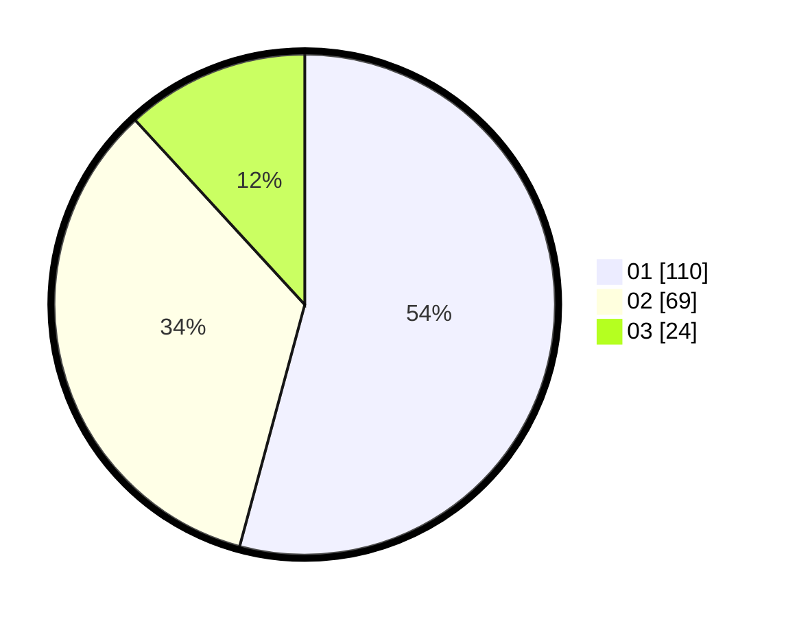

# Hasil

Hasil perolehan suara paslon dapat dilihat pada file paslon-01.txt, paslon-02.txt, dan paslon-03.txt.

Jika tidak ada, artinya data tersebut belum ada pada SIREKAP.

## Perolehan Suara

 * Paslon 01: **110**.
 * Paslon 02: **69**.
 * Paslon 03: **24**.

## Foto C Plano

https://sirekap-obj-formc.kpu.go.id/5b89/pemilu/ppwp/31/71/03/10/03/3171031003032-20240216-003718--76f978aa-0c8f-452d-b29b-377398ee0167.jpg

https://sirekap-obj-formc.kpu.go.id/5b89/pemilu/ppwp/31/71/03/10/03/3171031003032-20240216-003720--b6ab5b3e-dbc1-469a-a9f3-ea1cb1e5a9cf.jpg

https://sirekap-obj-formc.kpu.go.id/5b89/pemilu/ppwp/31/71/03/10/03/3171031003032-20240216-003719--4155d4e5-0e95-4585-bba9-217bc2bd2990.jpg

## DATA PEMILIH TETAP

Jumlah pemilih dalam DPT: **0**.
 * L: **0**.
 * P: **0**.

## DATA PENGGUNA HAK PILIH

Jumlah pengguna hak pilih dalam DPT: **0**.
 * L: **0**.
 * P: **0**.

Jumlah pengguna hak pilih dalam DPTb: **0**.
 * L: **0**.
 * P: **0**.

Jumlah pengguna hak pilih dalam DPK: **0**.
 * L: **0**.
 * P: **0**.

Jumlah pengguna hak pilih: **0**.
 * L: **0**.
 * P: **0**.

## JUMLAH SUARA SAH DAN TIDAK SAH

JUMLAH SELURUH SUARA SAH: **203**.

JUMLAH SUARA TIDAK SAH: **3**.

JUMLAH SELURUH SUARA SAH DAN SUARA TIDAK SAH: **206**.
