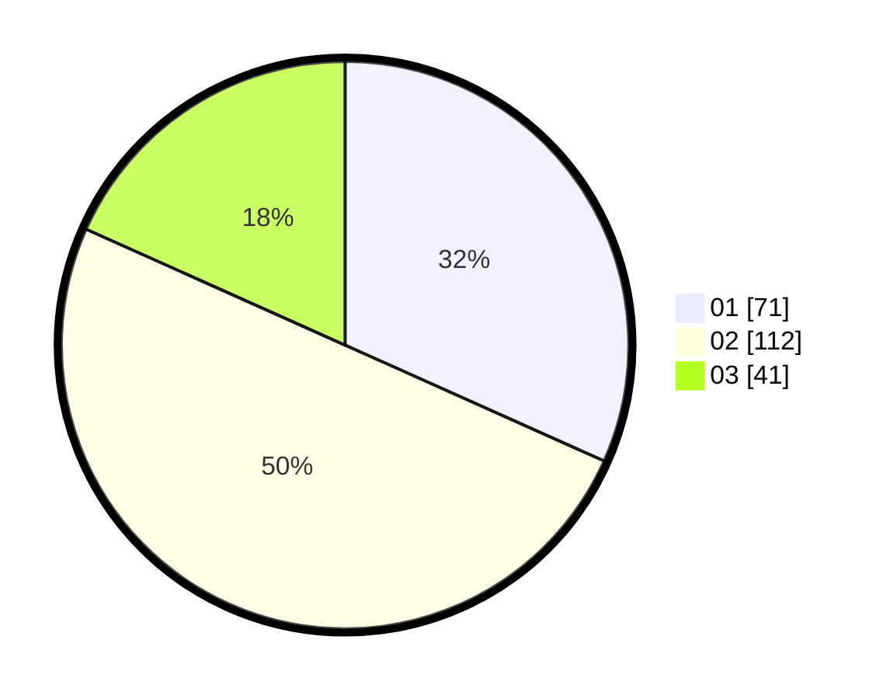

# Hasil

Hasil perolehan suara paslon dapat dilihat pada file paslon-01.txt, paslon-02.txt, dan paslon-03.txt.

Jika tidak ada, artinya data tersebut belum ada pada SIREKAP.

## Perolehan Suara

 * Paslon 01: **71**.
 * Paslon 02: **112**.
 * Paslon 03: **41**.

## Foto C Plano

https://sirekap-obj-formc.kpu.go.id/d107/pemilu/ppwp/31/71/03/10/03/3171031003033-20240216-173150--2fc336fe-2032-4534-8a4a-c57f6cab70db.jpg

https://sirekap-obj-formc.kpu.go.id/d107/pemilu/ppwp/31/71/03/10/03/3171031003033-20240216-192116--338f303a-d7f8-495b-9628-981141bb5cdd.jpg

https://sirekap-obj-formc.kpu.go.id/d107/pemilu/ppwp/31/71/03/10/03/3171031003033-20240216-191043--8f36f593-b752-41e5-9bbd-2a0b05415e44.jpg
