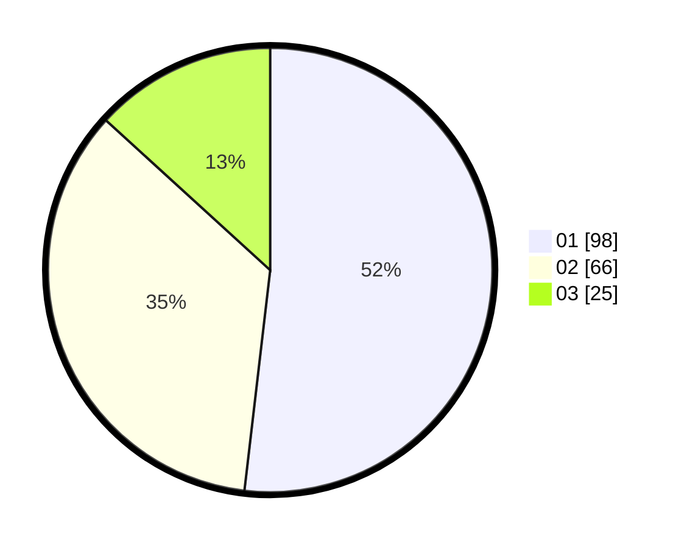

# Hasil

Hasil perolehan suara paslon dapat dilihat pada file paslon-01.txt, paslon-02.txt, dan paslon-03.txt.

Jika tidak ada, artinya data tersebut belum ada pada SIREKAP.

## Perolehan Suara

 * Paslon 01: **98**.
 * Paslon 02: **66**.
 * Paslon 03: **25**.

## Foto C Plano

https://sirekap-obj-formc.kpu.go.id/f270/pemilu/ppwp/31/71/03/10/03/3171031003039-20240216-181816--777db306-1362-41bf-a94e-3651a2500289.jpg

https://sirekap-obj-formc.kpu.go.id/f270/pemilu/ppwp/31/71/03/10/03/3171031003039-20240216-181817--470efd61-8870-4e03-859c-fcc060b03830.jpg

https://sirekap-obj-formc.kpu.go.id/f270/pemilu/ppwp/31/71/03/10/03/3171031003039-20240216-181816--42ed366f-1c76-4c45-b45c-b3f59a46f6d4.jpg

## DATA PEMILIH TETAP

Jumlah pemilih dalam DPT: **258**.
 * L: **126**.
 * P: **132**.

## DATA PENGGUNA HAK PILIH

Jumlah pengguna hak pilih dalam DPT: **191**.
 * L: **85**.
 * P: **106**.

Jumlah pengguna hak pilih dalam DPTb: **3**.
 * L: **1**.
 * P: **2**.

Jumlah pengguna hak pilih dalam DPK: **1**.
 * L: **1**.
 * P: **0**.

Jumlah pengguna hak pilih: **195**.
 * L: **87**.
 * P: **108**.

## JUMLAH SUARA SAH DAN TIDAK SAH

JUMLAH SELURUH SUARA SAH: **189**.

JUMLAH SUARA TIDAK SAH: **6**.

JUMLAH SELURUH SUARA SAH DAN SUARA TIDAK SAH: **195**.
