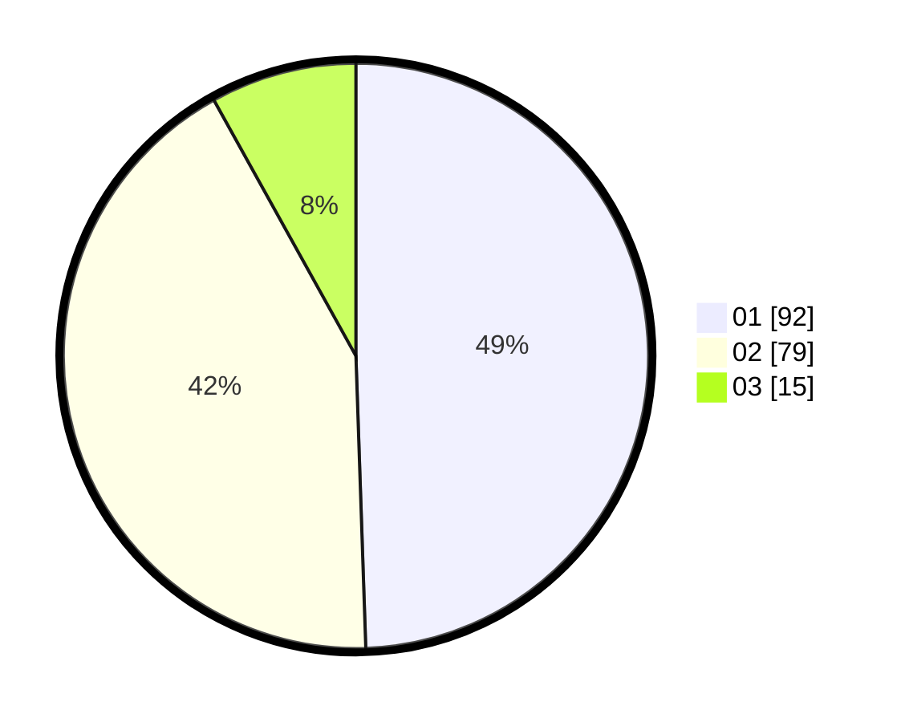

# Hasil

Hasil perolehan suara paslon dapat dilihat pada file paslon-01.txt, paslon-02.txt, dan paslon-03.txt.

Jika tidak ada, artinya data tersebut belum ada pada SIREKAP.

## Perolehan Suara

 * Paslon 01: **92**.
 * Paslon 02: **79**.
 * Paslon 03: **15**.

## Foto C Plano

https://sirekap-obj-formc.kpu.go.id/c188/pemilu/ppwp/31/71/03/10/03/3171031003043-20240216-191643--190c977a-fd5f-469b-b8f3-fdcb849a8eec.jpg

https://sirekap-obj-formc.kpu.go.id/c188/pemilu/ppwp/31/71/03/10/03/3171031003043-20240216-191644--0186de4f-c3d6-471d-8d8c-e03c25e58a85.jpg

https://sirekap-obj-formc.kpu.go.id/c188/pemilu/ppwp/31/71/03/10/03/3171031003043-20240216-191643--2e2987fb-8e32-4c61-a271-78066868394c.jpg

## DATA PEMILIH TETAP

Jumlah pemilih dalam DPT: **271**.
 * L: **134**.
 * P: **137**.

## DATA PENGGUNA HAK PILIH

Jumlah pengguna hak pilih dalam DPT: **185**.
 * L: **88**.
 * P: **97**.

Jumlah pengguna hak pilih dalam DPTb: **2**.
 * L: **1**.
 * P: **1**.

Jumlah pengguna hak pilih dalam DPK: **3**.
 * L: **3**.
 * P: **0**.

Jumlah pengguna hak pilih: **190**.
 * L: **92**.
 * P: **98**.

## JUMLAH SUARA SAH DAN TIDAK SAH

JUMLAH SELURUH SUARA SAH: **186**.

JUMLAH SUARA TIDAK SAH: **4**.

JUMLAH SELURUH SUARA SAH DAN SUARA TIDAK SAH: **190**.
