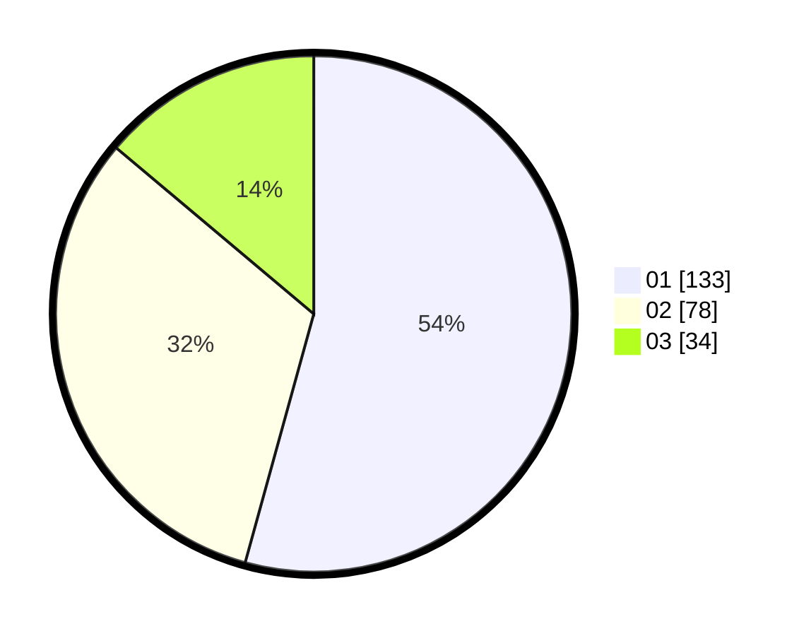

# Hasil

Hasil perolehan suara paslon dapat dilihat pada file paslon-01.txt, paslon-02.txt, dan paslon-03.txt.

Jika tidak ada, artinya data tersebut belum ada pada SIREKAP.

## Perolehan Suara

 * Paslon 01: **133**.
 * Paslon 02: **78**.
 * Paslon 03: **34**.

## Foto C Plano

https://sirekap-obj-formc.kpu.go.id/cb29/pemilu/ppwp/31/71/03/10/03/3171031003047-20240214-203224--d149945e-e688-4107-8e37-1a485be3edc5.jpg

https://sirekap-obj-formc.kpu.go.id/cb29/pemilu/ppwp/31/71/03/10/03/3171031003047-20240214-203111--ec087634-de0f-40fe-8412-123c47e71cda.jpg

https://sirekap-obj-formc.kpu.go.id/cb29/pemilu/ppwp/31/71/03/10/03/3171031003047-20240214-202944--e0ae30b2-de3b-457a-84ad-f9c5efeed99b.jpg

## DATA PEMILIH TETAP

Jumlah pemilih dalam DPT: **293**.
 * L: **146**.
 * P: **147**.

## DATA PENGGUNA HAK PILIH

Jumlah pengguna hak pilih dalam DPT: **245**.
 * L: **119**.
 * P: **126**.

Jumlah pengguna hak pilih dalam DPTb: **0**.
 * L: **0**.
 * P: **0**.

Jumlah pengguna hak pilih dalam DPK: **2**.
 * L: **1**.
 * P: **1**.

Jumlah pengguna hak pilih: **247**.
 * L: **120**.
 * P: **127**.

## JUMLAH SUARA SAH DAN TIDAK SAH

JUMLAH SELURUH SUARA SAH: **245**.

JUMLAH SUARA TIDAK SAH: **2**.

JUMLAH SELURUH SUARA SAH DAN SUARA TIDAK SAH: **247**.
