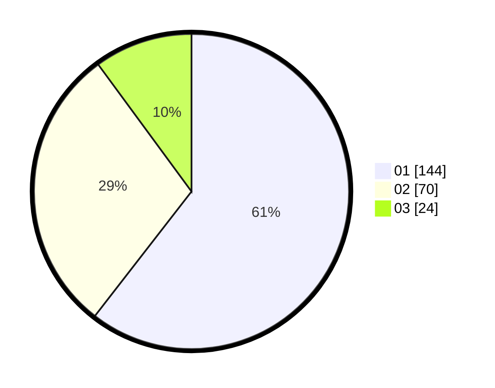

# Hasil

Hasil perolehan suara paslon dapat dilihat pada file paslon-01.txt, paslon-02.txt, dan paslon-03.txt.

Jika tidak ada, artinya data tersebut belum ada pada SIREKAP.

## Perolehan Suara

 * Paslon 01: **144**.
 * Paslon 02: **70**.
 * Paslon 03: **24**.

## Foto C Plano

https://sirekap-obj-formc.kpu.go.id/a55f/pemilu/ppwp/31/71/03/10/03/3171031003050-20240214-203215--03398b0b-28ca-41fe-bfdc-9fae1f5fdbbb.jpg

https://sirekap-obj-formc.kpu.go.id/a55f/pemilu/ppwp/31/71/03/10/03/3171031003050-20240214-203254--f505b01e-9d14-4055-87ed-43ecc20e89ce.jpg

https://sirekap-obj-formc.kpu.go.id/a55f/pemilu/ppwp/31/71/03/10/03/3171031003050-20240214-203637--f58397c9-ad58-4bfa-a950-fb180e064d36.jpg

## DATA PEMILIH TETAP

Jumlah pemilih dalam DPT: **288**.
 * L: **138**.
 * P: **150**.

## DATA PENGGUNA HAK PILIH

Jumlah pengguna hak pilih dalam DPT: **242**.
 * L: **118**.
 * P: **124**.

Jumlah pengguna hak pilih dalam DPTb: **0**.
 * L: **0**.
 * P: **0**.

Jumlah pengguna hak pilih dalam DPK: **0**.
 * L: **0**.
 * P: **0**.

Jumlah pengguna hak pilih: **242**.
 * L: **118**.
 * P: **124**.

## JUMLAH SUARA SAH DAN TIDAK SAH

JUMLAH SELURUH SUARA SAH: **238**.

JUMLAH SUARA TIDAK SAH: **4**.

JUMLAH SELURUH SUARA SAH DAN SUARA TIDAK SAH: **242**.
